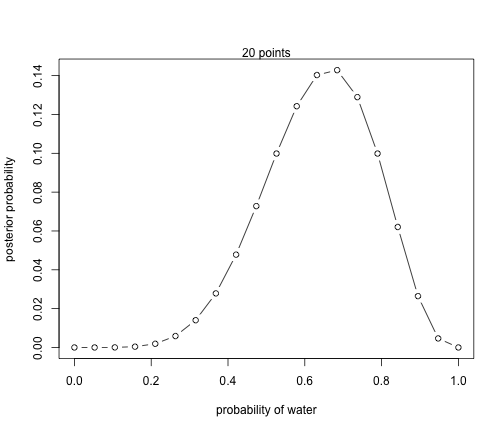
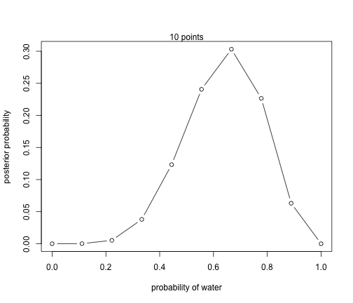
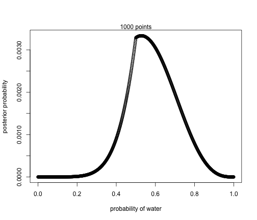

R Club
========================================================

02/04/2016 Chapter 2
========================================================

plausibility/probolities = one conjecture/ sum of plauiblibe for all conjectures

paramter -proportion of blue marbles, p
likelihood - number of ways that a value p can produce the data
prior probability - prior plausibility of p
posterior probability - updated plauibility


```r
library(rethinking)
```

```
## Loading required package: rstan
```

```
## Loading required package: ggplot2
```

```
## rstan (Version 2.9.0, packaged: 2016-01-05 16:17:47 UTC, GitRev: 05c3d0058b6a)
```

```
## For execution on a local, multicore CPU with excess RAM we recommend calling
## rstan_options(auto_write = TRUE)
## options(mc.cores = parallel::detectCores())
```

```
## Loading required package: parallel
```

```
## rethinking (Version 1.58)
```

```r
ways <- c( 0 , 3 , 8 , 9 , 0 )
ways/sum(ways)
```

```
## [1] 0.00 0.15 0.40 0.45 0.00
```

Likelyhoood of data- six waters (results)
Relative number of ways to see the data w, given values p and n

```r
dbinom( 6 , size=9 , prob=0.1 )
```

```
## [1] 6.1236e-05
```

```r
dbinom( 6 , size=9 , prob=0.5 )
```

```
## [1] 0.1640625
```

```r
dbinom( 6 , size=9 , prob=0.6 )
```

```
## [1] 0.2508227
```

```r
dbinom( 6 , size=9 , prob=0.9 )
```

```
## [1] 0.04464104
```


2E1. Which of the expressions below correspond to the statement:
the probability of rain on Monday?

(2) Pr(rain|Monday)
 
2E2 Which of the following statements corresponds to the expression: Pr(Monday|rain)?

(4) The probability that it is Monday and that it is raining.

2E3 Which of the expressions below correspond to the statement: the probability that it is Monday, given that it is raining?

(4) Pr(rain|Monday)Pr(Monday)/Pr(rain)

2E4 The Bayesian statistician Bruno de Finetti (1906–1985) began his book on probability theory with the declaration: “PROBABILITY DOES NOT EXIST.” The capitals appeared in the original, so I imagine de Finetti wanted us to shout this statement. What he meant is that probability is a device for describing uncertainty from the perspective of an observer with limited knowledge; it has no objective reality. Discuss the globe tossing example from the chapter, in light of this statement. What does it mean to say “the probability of water is 0.7”?

That it is highly likey that there is 70% water on the world  based on our small world data. It is also highly likey to have a value simialr to 70% such 40-80% and much more unlikely to have a value simliar to 1% or 100%.


2M3. 

Suppose there are two globes, one for Earth and one for Mars. The Earth globe is 70% covered in water. The Mars globe is 100% land. Further suppose that one of these globes—you don’t know which—was tossed in the air and produced a “land” observation. Assume that each globe was equally likely to be tossed. Show that the posterior probability that the globe was the Earth, conditional on seeing “land” (Pr(Earth|land)), is 0.23.

Posterior = Likelihood × Prior Average Likelihood
Pr(Earth|land) = Pr(land|Earth) * Pr(Earth) / Pr(land)
Pr(Earth) = 0.5
Pr(Land) = 0.5
Pr(land|Earth) =  Pr(Earth|land) 
Pr(Earth|land)  = 0.23 * 0.5/ 0.5
Pr(Earth|land)  = 0.23


2M4.

Suppose you have a deck with only three cards. Each card has two sides, and each side is either black or white. One card has two black sides. The second card has one black and one white side. The third card has two white sides. Now suppose all three cards are placed in a bag and shuffled. Someone reaches into the bag and pulls out a card and places it flat on a table. A black side is shown facing up, but you don’t know the color of the side facing down. Show that the probability that the other side is also black is 2/3. Use the counting method (Section 2 of the chapter) to approach this problem. This means counting up the ways that each card could produce the observed data (a black side facing up on the table).

white, white = 1 X 0 = 0
black, white = 2 X 1 = 2/3
black, black = 1 X 1 = 1/3


Grid Approx
=================
Appoximate model by using a finite grid of parameter values. At any value of a paramter (p) its a simile manner to computue the posterior probality

unstanderized posterior = likelihood X Prior

* often not used becauasuse scales poorly with many paramters 

### bulid grid 

1. Def grid
   * make list of paramters on grid
   * make list of number of points to estimate the posterior
2. Compute the values of prior at each paramter on grid
3. Compute likelyhood at each paramter
4. unstanderized posterior = likelihood X Prior
5. Standerdize by dividing by sum of all values


```r
## define grid
p_grid <- seq( from=0 , to=1 , length.out=20 )
p_grid
```

```
##  [1] 0.00000000 0.05263158 0.10526316 0.15789474 0.21052632 0.26315789
##  [7] 0.31578947 0.36842105 0.42105263 0.47368421 0.52631579 0.57894737
## [13] 0.63157895 0.68421053 0.73684211 0.78947368 0.84210526 0.89473684
## [19] 0.94736842 1.00000000
```

```r
# define prior
prior <- rep( 1 , 20 )
prior
```

```
##  [1] 1 1 1 1 1 1 1 1 1 1 1 1 1 1 1 1 1 1 1 1
```

```r
### ALL PRIORS Equal
# compute likelihood at each value in grid
# gvien that water is seen six times when you run 9 times small world examples... likeluhood of seeing water at each point
likelihood <- dbinom( 6 , size=9 , prob=p_grid )
# compute product of likelihood and prior
unstd.posterior <- likelihood * prior
unstd.posterior
```

```
##  [1] 0.000000e+00 1.518149e-06 8.185093e-05 7.772923e-04 3.598575e-03
##  [6] 1.116095e-02 2.668299e-02 5.292110e-02 9.082698e-02 1.383413e-01
## [11] 1.897686e-01 2.361147e-01 2.666113e-01 2.714006e-01 2.450051e-01
## [16] 1.897686e-01 1.179181e-01 5.026670e-02 8.853845e-03 0.000000e+00
```

```r
# standardize the posterior, so it sums to 1
posterior <- unstd.posterior / sum(unstd.posterior)
```

Posterior Distrubution 20 points:


```r
plot( p_grid , posterior , type="b" ,
    xlab="probability of water" , ylab="posterior probability" )
mtext( "20 points" )
```



Posterior Distrubution 10 points:


```r
p_grid <- seq( from=0 , to=1 , length.out=10 )
p_grid
```

```
##  [1] 0.0000000 0.1111111 0.2222222 0.3333333 0.4444444 0.5555556 0.6666667
##  [8] 0.7777778 0.8888889 1.0000000
```

```r
# define prior
prior <- rep( 1 , 10 )
prior
```

```
##  [1] 1 1 1 1 1 1 1 1 1 1
```

```r
### ALL PRIORS Equal
# compute likelihood at each value in grid
likelihood <- dbinom( 6 , size=9 , prob=p_grid )
# compute product of likelihood and prior
unstd.posterior <- likelihood * prior
unstd.posterior
```

```
##  [1] 0.0000000000 0.0001110112 0.0047596037 0.0341411370 0.1110111654
##  [6] 0.2168186825 0.2731290962 0.2040680094 0.0568377167 0.0000000000
```

```r
# standardize the posterior, so it sums to 1
posterior <- unstd.posterior / sum(unstd.posterior)
```

Posterior Distrubution 10 points:


```r
plot( p_grid , posterior , type="b" ,
    xlab="probability of water" , ylab="posterior probability" )
mtext( "10 points" )
```



Posterior Distrubution 1000 points:


```r
p_grid <- seq( from=0 , to=1 , length.out=1000 )

# define prior
prior <- rep( 1 , 1000 )
### ALL PRIORS Equal
prior <- ifelse( p_grid < 0.5 , 0 , 1 )
###ONLY PRIOR greater than .5 is likly
prior <- exp( -5*abs( p_grid - 0.5 ) )
### prior depends on value minus half

# compute likelihood at each value in grid
likelihood <- dbinom( 6 , size=9 , prob=p_grid )
# compute product of likelihood and prior
unstd.posterior <- likelihood * prior
# standardize the posterior, so it sums to 1
posterior <- unstd.posterior / sum(unstd.posterior)
```

Posterior Distrubution 1000 points:


```r
plot( p_grid , posterior , type="b" ,
    xlab="probability of water" , ylab="posterior probability" )
mtext( "1000 points" )
```



quadrtic qpproximation
=======================

* used in models with many patamters 
