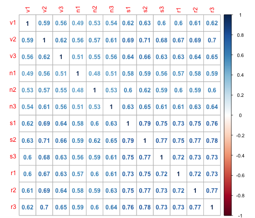
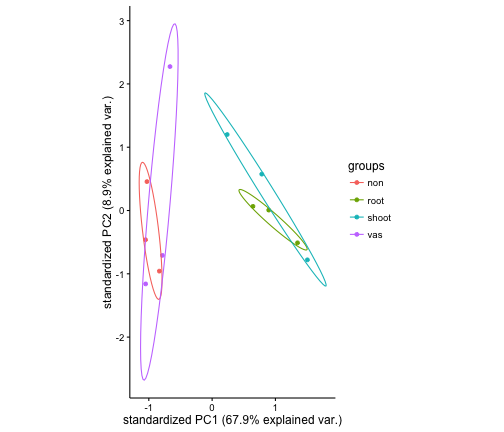

CLUSTERING REPS
========================================================

Supervised (Logistic regression, known groups) and unsupervised learning (trying to discover divation between groups)

Distance measures are the most crucial decision in clustering- determines what it means for two clusters to be close or far.

Euclidean
Manalanobis- weighted euclidean
Correlation


Load data and determine distance

CG REPS joined by 4X coverage and methylation number
========================================================


```r
CG = "/Users/gturco/Downloads/daff1a3b-18e1-48b8-9c33-fffd5a6d2558-000000"
x = read.table(CG, col.names=c("seqid","start","strand","v1","v2","v3","n1","n2","n3","s1","s2","s3","r1","r2","r3"), sep="\t", header= FALSE)
cg.corr <- cor(x[,4:15])
```


```r
library(corrplot)
corrplot(cg.corr, method="number")
```


```r
library(ggbiplot)
```

```
## Loading required package: ggplot2
```

```
## Loading required package: plyr
```

```
## Loading required package: scales
```

```
## Loading required package: grid
```

```r
y <- t(head(x[,4:15], n=144195))
vars <- c("vas","vas","vas","non","non","non","shoot","shoot","shoot","root","root","root")
z <- cbind.data.frame(y,vars)
cg.pca <- prcomp(z[,1:34176], scale. = FALSE)
ggbiplot(cg.pca, groups = vars , ellipse = TRUE, circle = TRUE, var.axes=FALSE) + theme_classic() 
```


REPS joined by 4X coverage and methylation binary from bimodal test
==================================================================


```r
CG = "/Users/gturco/Downloads/dca9cc39-a9c5-4585-9ad9-b67db560033b-000000-CG"
x = read.table(CG, col.names=c("seqid","start","v1","v2","v3","n1","n2","n3","s1","s2","s3","r1","r2","r3"), sep="\t", header= FALSE)
cg.corr <- cor(x[,3:14])
library(corrplot)
corrplot(cg.corr, method="number")
```


```r
y <- t(head(x[,3:14], n=34176))
vars <- c("vas","vas","vas","non","non","non","shoot","shoot","shoot","root","root","root")
z <- cbind.data.frame(y,vars)
cg.pca <- prcomp(z[,1:34176], scale. = FALSE)
ggbiplot(cg.pca, groups = vars , ellipse = TRUE, circle = TRUE, var.axes=FALSE) + theme_classic() 
```


CHG REPS joined by 4X coverage and methylation number
========================================================


```r
CHG = "/Users/gturco/Downloads/02816c02-8fb8-48c0-a828-4c0ae3b81782-000000"
x = read.table(CHG, col.names=c("seqid","start","strand","v1","v2","v3","n1","n2","n3","s1","s2","s3","r1","r2","r3"), sep="\t", header= FALSE)
chg.corr <- cor(x[,4:15])
corrplot(chg.corr, method="number")
```


```r
y <- t(head(x[,4:15], n=179975))
vars <- c("vas","vas","vas","non","non","non","shoot","shoot","shoot","root","root","root")
z <- cbind.data.frame(y,vars)
chg.pca <- prcomp(z[,1:179975], scale. = FALSE)
ggbiplot(chg.pca, groups = vars , ellipse = TRUE, circle = TRUE, var.axes=FALSE) + theme_classic() 
```


REPS joined by 4X coverage and methylation binary from bimodal test
======================================================================


```r
CHG = "/Users/gturco/Downloads/3ec25dc9-0bfe-4c31-82ee-e916aadd5f78-000000-root2"
x = read.table(CHG, col.names=c("seqid","start","strand","v1","v2","v3","n1","n2","n3","s1","s2","s3","r1","r2","r3"), sep="\t", header= FALSE)
```

```
## Error in scan(file, what, nmax, sep, dec, quote, skip, nlines, na.strings, : line 1 did not have 15 elements
```

```r
chg.corr <- cor(x[,3:14])
```

```
## Error in cor(x[, 3:14]): 'x' must be numeric
```

```r
corrplot(chg.corr, method="number")
```




```r
CHG = "/Users/gturco/Downloads/3ec25dc9-0bfe-4c31-82ee-e916aadd5f78-000000-root2"
x = read.table(CHG, col.names=c("seqid","start","v1","v2","v3","n1","n2","n3","s1","s2","s3","r1","r2","r3"), sep="\t", header= FALSE)


y <- t(head(x[,3:14], n=5359))
vars <- c("vas","vas","vas","non","non","non","shoot","shoot","shoot","root","root","root")
z <- cbind.data.frame(y,vars)
chg.pca <- prcomp(z[,1:5359], scale. = FALSE)
ggbiplot(chg.pca,
  groups = vars , ellipse = TRUE, circle = TRUE, var.axes=FALSE) + theme_classic() 
```


REPS joined by 4X coverage and methylation binary from bimodal test
======================================================================


```r
CHG = "/Users/gturco/Downloads/3ec25dc9-0bfe-4c31-82ee-e916aadd5f78-000000"
x = read.table(CHG, col.names=c("seqid","start","strand","v1","v2","v3","n1","n2","n3","s1","s2","s3","r1","r2","r3"), sep="\t", header= FALSE)
```

```
## Error in scan(file, what, nmax, sep, dec, quote, skip, nlines, na.strings, : line 1 did not have 15 elements
```

```r
chg.corr <- cor(x[,3:14])
corrplot(chg.corr, method="number")
```


```r
CHG = "/Users/gturco/Downloads/3ec25dc9-0bfe-4c31-82ee-e916aadd5f78-000000"
x = read.table(CHG, col.names=c("seqid","start","v1","v2","v3","n1","n2","n3","s1","s2","s3","r1","r2","r3"), sep="\t", header= FALSE)


y <- t(head(x[,3:14], n=5359))
vars <- c("vas","vas","vas","non","non","non","shoot","shoot","shoot","root","root","root")
z <- cbind.data.frame(y,vars)
chg.pca <- prcomp(z[,1:5359], scale. = FALSE)
ggbiplot(chg.pca,
  groups = vars , ellipse = TRUE, circle = TRUE, var.axes=FALSE) + theme_classic() 
```


REPS joined by 4X coverage and methylation binary from bimodal test
======================================================================


```r
CHH = "/Users/gturco/Downloads/44658b09-0d96-4e9f-9849-3f690ea53a1b-000000"
x = read.table(CHH, col.names=c("seqid","start","v1","v2","v3","n1","n2","n3","s1","s2","s3","r1","r2","r3"), sep="\t", header= FALSE)
chh.corr <- cor(x[,3:14])
corrplot(chh.corr, method="number")
```


```r
y <- t(head(x[,3:14], n=48562))
vars <- c("vas","vas","vas","non","non","non","shoot","shoot","shoot","root","root","root")
z <- cbind.data.frame(y,vars)
chh.pca <- prcomp(z[,1:48562], scale. = FALSE)
ggbiplot(chh.pca,
  groups = vars , ellipse = TRUE, circle = TRUE, var.axes=FALSE) + theme_classic() 
```


REPS joined by 4X coverage and methylation binary from bimodal test
======================================================================


```r
CHH = "/Users/gturco/Downloads/b1b568f6-4f9f-4eb4-8b87-599677885915-000000"
x = read.table(CHH, col.names=c("seqid","start","v1","v2","v3","n1","n2","n3","s1","s2","s3","r1","r2","r3"), sep="\t", header= FALSE)
chh.corr <- cor(x[,3:14])
corrplot(chh.corr, method="number")
```


```r
CHH = "/Users/gturco/Downloads/b1b568f6-4f9f-4eb4-8b87-599677885915-000000"
x = read.table(CHH, col.names=c("seqid","start","v1","v2","v3","n1","n2","n3","s1","s2","s3","r1","r2","r3"), sep="\t", header= FALSE)


y <- t(head(x[,3:14], n=5359))
vars <- c("vas","vas","vas","non","non","non","shoot","shoot","shoot","root","root","root")
z <- cbind.data.frame(y,vars)
chg.pca <- prcomp(z[,1:5359], scale. = FALSE)
ggbiplot(chg.pca,
  groups = vars , ellipse = TRUE, circle = TRUE, var.axes=FALSE) + theme_classic() 
```


