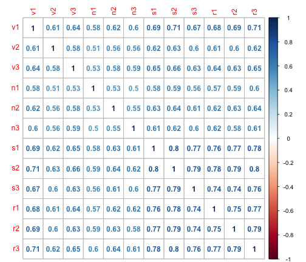
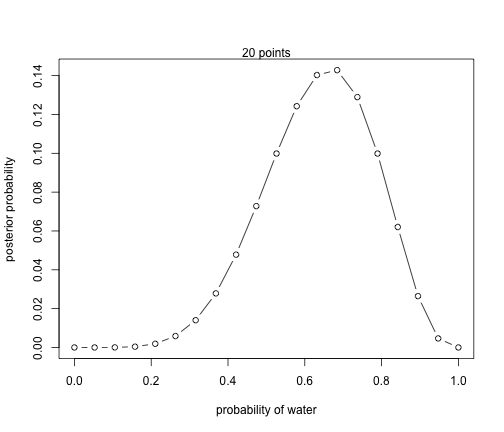

Tissue Data
==============

```r
library(ggplot2)

sig = c(0.007,0.15,0.0002,0.0275,0.6112,0.028,0.8,0.87,0,0.005,0.094,0)
mtype = c("CG","CHG","CHH","CG","CHG","CHH","CG","CHG","CHH", "CG","CHG","CHH")
ttype = c("vascular","vascular","vascular","nonvascular","nonvascular","nonvascular","root","root","root","shoot","shoot","shoot")
x <- cbind(sig,mtype,ttype)
x <- data.frame(x)
x$sig = as.numeric(as.character(x$sig))
x$pval <- cut(x$sig, breaks = c(-Inf, 0.001, 0.005, 0.05, 1))
ggplot(x, aes(mtype, ttype, fill = pval)) + geom_tile() + scale_fill_brewer(palette = "Blues",direction=1) + theme_classic() + theme(text=element_text(size=20))    +  
  theme(text=element_text(size=12), panel.margin = unit(0, "cm"), 
        plot.margin = unit(c(0, 0, 0.01, 0), "cm"),axis.ticks = element_line(size = 0.1), 
        axis.line = element_line(size = 0.1), axis.ticks.length = unit(0.05, "cm"), axis.ticks.margin =unit(0, "cm")) + 
  xlab(NULL) + ylab(NULL) 
```

```
## Warning: `axis.ticks.margin` is deprecated. Please set `margin` property of
## `axis.text` instead
```


CG Data
==============

```r
file_name = "/Users/gturco/Documents/code/Brady/bs_seq_analysis/genic_analysis/sig_heatmaps/tissue/CG_all.txt"
x = read.table(file_name ,sep='\t',header=FALSE)
colnames(x) <- c("pos","sig","mtype")
x$pval <- cut(x$sig, breaks = c(-Inf, 0.001, 0.005, 0.05, 1))

ggplot(x, aes(pos, mtype, fill = pval)) + geom_tile() + scale_fill_brewer(palette = "Reds",direction=-1) + theme_classic() + theme(text=element_text(size=20))    +  
  theme(text=element_text(size=12), panel.margin = unit(0, "cm"), 
        plot.margin = unit(c(0, 0, 0.01, 0), "cm"),axis.ticks = element_line(size = 0.1), 
        axis.line = element_line(size = 0.1), axis.ticks.length = unit(0.05, "cm"), axis.ticks.margin =unit(0, "cm")) + 
  xlab(NULL) + ylab(NULL) 
```

```
## Warning: `axis.ticks.margin` is deprecated. Please set `margin` property of
## `axis.text` instead
```




```r
file_name = "/Users/gturco/Documents/code/Brady/bs_seq_analysis/genic_analysis/sig_heatmaps/tissue/strict/CG_all.txt"
x = read.table(file_name ,sep='\t',header=FALSE)
colnames(x) <- c("pos","sig","mtype")
x$pval <- cut(x$sig, breaks = c(-Inf, 0.001, 0.005, 0.05, 1))

ggplot(x, aes(pos, mtype, fill = pval)) + geom_tile() + scale_fill_brewer(palette = "Reds",direction=-1) + theme_classic() + theme(text=element_text(size=20))    +  
  theme(text=element_text(size=12), panel.margin = unit(0, "cm"), 
        plot.margin = unit(c(0, 0, 0.01, 0), "cm"),axis.ticks = element_line(size = 0.1), 
        axis.line = element_line(size = 0.1), axis.ticks.length = unit(0.05, "cm"), axis.ticks.margin =unit(0, "cm")) + 
  xlab(NULL) + ylab(NULL) 
```

```
## Warning: `axis.ticks.margin` is deprecated. Please set `margin` property of
## `axis.text` instead
```


CHG Data
==============

```r
file_name = "/Users/gturco/Documents/code/Brady/bs_seq_analysis/genic_analysis/sig_heatmaps/tissue/CHG_all.txt"
x = read.table(file_name ,sep='\t',header=FALSE)
colnames(x) <- c("pos","sig","mtype")
x$pval <- cut(x$sig, breaks = c(-Inf, 0.001, 0.005, 0.05, 1))

ggplot(x, aes(pos, mtype, fill = pval)) + geom_tile() + scale_fill_brewer(palette = "Blues",direction=-1) + theme_classic() + theme(text=element_text(size=20))    +  
  theme(text=element_text(size=12), panel.margin = unit(0, "cm"), 
        plot.margin = unit(c(0, 0, 0.01, 0), "cm"),axis.ticks = element_line(size = 0.1), 
        axis.line = element_line(size = 0.1), axis.ticks.length = unit(0.05, "cm"), axis.ticks.margin =unit(0, "cm")) + 
  xlab(NULL) + ylab(NULL) 
```

```
## Warning: `axis.ticks.margin` is deprecated. Please set `margin` property of
## `axis.text` instead
```




```r
file_name = "/Users/gturco/Documents/code/Brady/bs_seq_analysis/genic_analysis/sig_heatmaps/tissue/strict/CHG_all.txt"
x = read.table(file_name ,sep='\t',header=FALSE)
colnames(x) <- c("pos","sig","mtype")
x$pval <- cut(x$sig, breaks = c(-Inf, 0.001, 0.005, 0.05, 1))

ggplot(x, aes(pos, mtype, fill = pval)) + geom_tile() + scale_fill_brewer(palette = "Blues",direction=-1) + theme_classic() + theme(text=element_text(size=20))    +  
  theme(text=element_text(size=12), panel.margin = unit(0, "cm"), 
        plot.margin = unit(c(0, 0, 0.01, 0), "cm"),axis.ticks = element_line(size = 0.1), 
        axis.line = element_line(size = 0.1), axis.ticks.length = unit(0.05, "cm"), axis.ticks.margin =unit(0, "cm")) + 
  xlab(NULL) + ylab(NULL) 
```

```
## Warning: `axis.ticks.margin` is deprecated. Please set `margin` property of
## `axis.text` instead
```


CHH Data
==============

```r
file_name = "/Users/gturco/Documents/code/Brady/bs_seq_analysis/genic_analysis/sig_heatmaps/tissue/CHH_all.txt"
x = read.table(file_name ,sep='\t',header=FALSE)
colnames(x) <- c("pos","sig","mtype")
x$pval <- cut(x$sig, breaks = c(-Inf, 0.001, 0.005, 0.05, 1))

ggplot(x, aes(pos, mtype, fill = pval)) + geom_tile() + scale_fill_brewer(palette = "Greens",direction=-1) + theme_classic() + theme(text=element_text(size=20))    +  
  theme(text=element_text(size=12), panel.margin = unit(0, "cm"), 
        plot.margin = unit(c(0, 0, 0.01, 0), "cm"),axis.ticks = element_line(size = 0.1), 
        axis.line = element_line(size = 0.1), axis.ticks.length = unit(0.05, "cm"), axis.ticks.margin =unit(0, "cm")) + 
  xlab(NULL) + ylab(NULL) 
```

```
## Warning: `axis.ticks.margin` is deprecated. Please set `margin` property of
## `axis.text` instead
```


```r
file_name = "/Users/gturco/Documents/code/Brady/bs_seq_analysis/genic_analysis/sig_heatmaps/tissue/strict/CHH_all.txt"
x = read.table(file_name ,sep='\t',header=FALSE)
colnames(x) <- c("pos","sig","mtype")
x$pval <- cut(x$sig, breaks = c(-Inf, 0.001, 0.005, 0.05, 1))

ggplot(x, aes(pos, mtype, fill = pval)) + geom_tile() + scale_fill_brewer(palette = "Greens",direction=-1) + theme_classic() + theme(text=element_text(size=20))    +  
  theme(text=element_text(size=12), panel.margin = unit(0, "cm"), 
        plot.margin = unit(c(0, 0, 0.01, 0), "cm"),axis.ticks = element_line(size = 0.1), 
        axis.line = element_line(size = 0.1), axis.ticks.length = unit(0.05, "cm"), axis.ticks.margin =unit(0, "cm")) + 
  xlab(NULL) + ylab(NULL) 
```

```
## Warning: `axis.ticks.margin` is deprecated. Please set `margin` property of
## `axis.text` instead
```


