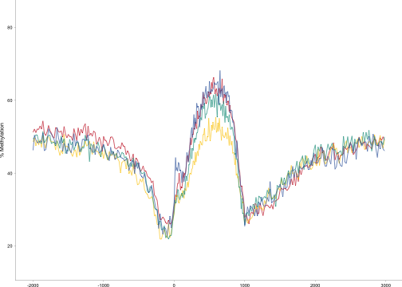
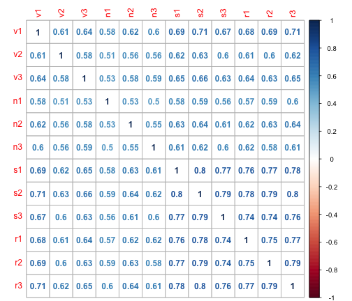
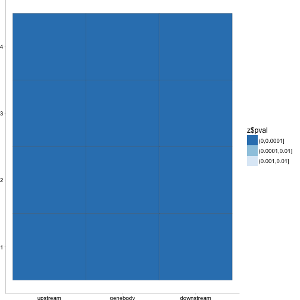

1. Filtered for 4X coverage and re-ran
2. Still not showing binomial distribution....


CG Methylation
========================================================


```r
library(ggplot2)
file_name = "/Users/gturco/Documents/Data/Sorg/11_25_2015/4x_cov_freq/non_cg_freq.txt"
non = read.table(file_name, col.names=c("methylation","freq"))
non = cbind(non,"non")
colnames(non) = c("methylation","freq","tissue")
  
file_name = "/Users/gturco/Documents/Data/Sorg/11_25_2015/4x_cov_freq/vas_cg.txt"
vas = read.table(file_name, col.names=c("methylation","freq"))
vas = cbind(vas,"vas")
colnames(vas) = c("methylation","freq","tissue")


file_name = "/Users/gturco/Documents/Data/Sorg/11_25_2015/4x_cov_freq/root_cg.txt"
root = read.table(file_name, col.names=c("methylation","freq"))
root = cbind(root,"root")
colnames(root) = c("methylation","freq","tissue")

file_name = "/Users/gturco/Documents/Data/Sorg/11_25_2015/4x_cov_freq/shoot_cg.txt"
shoot = read.table(file_name, col.names=c("methylation","freq"))
shoot = cbind(shoot,"shoot")
colnames(shoot) = c("methylation","freq","tissue")


x = rbind(non,vas,root,shoot)

ggplot(data=x, aes(x = methylation, y = log(freq), color=tissue)) +  geom_line(size = .3)  +
  theme_classic() + theme(text=element_text(size=20))    +  theme(text=element_text(size=7), panel.margin = unit(0, "cm"), plot.margin = unit(c(0, 0, 0.01, -0.1), "cm"),axis.ticks = element_line(size = 0.1), axis.line = element_line(size = 0.1), axis.ticks.length = unit(0.05, "cm"), axis.ticks.margin =unit(0, "cm")) + xlab(NULL) + ylab("% Methylation") + scale_colour_manual(values=c("#c6141c","#fccb0c","#009987","#3261a8")) 
```

```
## Warning: `axis.ticks.margin` is deprecated. Please set `margin` property of
## `axis.text` instead
```



CHG Methylation
========================================================


```r
file_name = "/Users/gturco/Documents/Data/Sorg/11_25_2015/4x_cov_freq/non_chg_freq.txt"
non = read.table(file_name, col.names=c("methylation","freq"))
non = cbind(non,"non")
colnames(non) = c("methylation","freq","tissue")
  
file_name = "/Users/gturco/Documents/Data/Sorg/11_25_2015/4x_cov_freq/vas_chg.txt"
vas = read.table(file_name, col.names=c("methylation","freq"))
vas = cbind(vas,"vas")
colnames(vas) = c("methylation","freq","tissue")


file_name = "/Users/gturco/Documents/Data/Sorg/11_25_2015/4x_cov_freq/root_chg.txt"
root = read.table(file_name, col.names=c("methylation","freq"))
root = cbind(root,"root")
colnames(root) = c("methylation","freq","tissue")

file_name = "/Users/gturco/Documents/Data/Sorg/11_25_2015/4x_cov_freq/shoot_chg.txt"
shoot = read.table(file_name, col.names=c("methylation","freq"))
shoot = cbind(shoot,"shoot")
colnames(shoot) = c("methylation","freq","tissue")


x = rbind(non,vas,root,shoot)

ggplot(data=x, aes(x = methylation, y = log(freq), color=tissue)) +  geom_line(size = .3)  +
  theme_classic() + theme(text=element_text(size=20))    +  theme(text=element_text(size=7), panel.margin = unit(0, "cm"), plot.margin = unit(c(0, 0, 0.01, -0.1), "cm"),axis.ticks = element_line(size = 0.1), axis.line = element_line(size = 0.1), axis.ticks.length = unit(0.05, "cm"), axis.ticks.margin =unit(0, "cm")) + xlab(NULL) + ylab("% Methylation") + scale_colour_manual(values=c("#c6141c","#fccb0c","#009987","#3261a8")) 
```

```
## Warning: `axis.ticks.margin` is deprecated. Please set `margin` property of
## `axis.text` instead
```



CHH Methylation
========================================================


```r
file_name = "/Users/gturco/Documents/Data/Sorg/11_25_2015/4x_cov_freq/non_chh_freq.txt"
non = read.table(file_name, col.names=c("methylation","freq"))
non = cbind(non,"non")
colnames(non) = c("methylation","freq","tissue")
  
file_name = "/Users/gturco/Documents/Data/Sorg/11_25_2015/4x_cov_freq/vas_chh.txt"
vas = read.table(file_name, col.names=c("methylation","freq"))
vas = cbind(vas,"vas")
colnames(vas) = c("methylation","freq","tissue")


file_name = "/Users/gturco/Documents/Data/Sorg/11_25_2015/4x_cov_freq/root_chh.txt"
root = read.table(file_name, col.names=c("methylation","freq"))
root = cbind(root,"root")
colnames(root) = c("methylation","freq","tissue")

file_name = "/Users/gturco/Documents/Data/Sorg/11_25_2015/4x_cov_freq/shoot_chh.txt"
shoot = read.table(file_name, col.names=c("methylation","freq"))
shoot = cbind(shoot,"shoot")
colnames(shoot) = c("methylation","freq","tissue")


x = rbind(non,vas,root,shoot)

ggplot(data=x, aes(x = methylation, y = log(freq), color=tissue)) +  geom_line(size = .3)  +
  theme_classic() + theme(text=element_text(size=20))    +  theme(text=element_text(size=7), panel.margin = unit(0, "cm"), plot.margin = unit(c(0, 0, 0.01, -0.1), "cm"),axis.ticks = element_line(size = 0.1), axis.line = element_line(size = 0.1), axis.ticks.length = unit(0.05, "cm"), axis.ticks.margin =unit(0, "cm")) + xlab(NULL) + ylab("% Methylation") + scale_colour_manual(values=c("#c6141c","#fccb0c","#009987","#3261a8")) 
```

```
## Warning: `axis.ticks.margin` is deprecated. Please set `margin` property of
## `axis.text` instead
```


