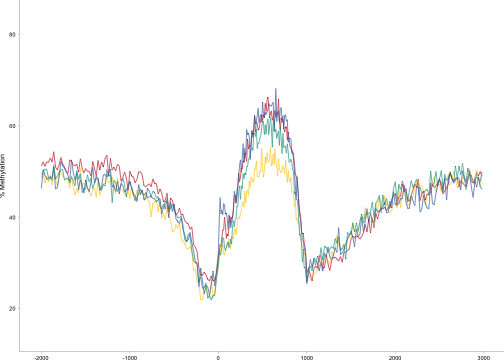
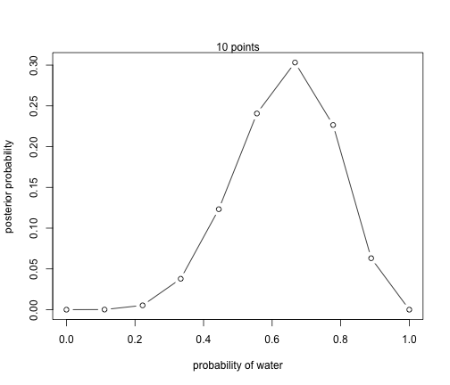
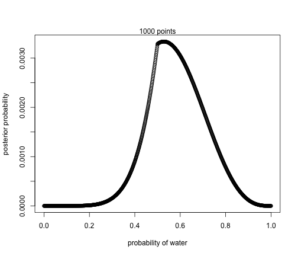
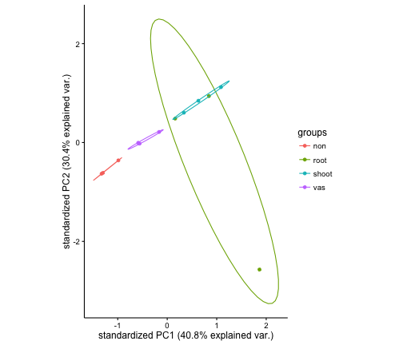
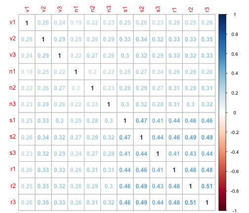

# TOS distributions

## CG Methylation distribtuions for each TOS

### CG the only one with a different   distribution  comes fom genes not expressed which are most similar to the general bimodal dist for methylation. 


```r
library("gridExtra")
library("ggplot2")
file_name = "/Users/gturco/Documents/tmp/RPKM_TOS_All.tsv"
x = read.table(file_name, header=TRUE, sep="\t")

n <- ggplot(x, aes(ncgmean, colour=tissue)) + geom_freqpoly() + ggtitle("Nonvascular all")
v <- ggplot(x, aes(vcgmean, colour=tissue)) + geom_freqpoly() + ggtitle("Vascular all")
s <- ggplot(x, aes(scgmean, colour=tissue)) + geom_freqpoly() + ggtitle("Shoot all")
r <- ggplot(x, aes(rcgmean, colour=tissue)) + geom_freqpoly() + ggtitle("Root all")

grid.arrange(n, v,s,r, ncol=2)
```

```
## `stat_bin()` using `bins = 30`. Pick better value with `binwidth`.
```

```
## Warning: Removed 7562 rows containing non-finite values (stat_bin).
```

```
## `stat_bin()` using `bins = 30`. Pick better value with `binwidth`.
```

```
## Warning: Removed 3794 rows containing non-finite values (stat_bin).
```

```
## `stat_bin()` using `bins = 30`. Pick better value with `binwidth`.
## `stat_bin()` using `bins = 30`. Pick better value with `binwidth`.
```



## Can we see the diffrent disstibutions between tissue types?

### Root and Shoot have a higher freq of lower methylation in comparsion to vascular and nonvascular


```r
y = cbind.data.frame(x$ncgmean,x$vcgmean,x$scgmean,x$rcgmean)
colnames(y) <- c("non","vas","shoot","root")

library("reshape")
ty <- melt(y)
```

```
## Using  as id variables
```

```r
ggplot(ty, aes(value, colour=variable)) + geom_freqpoly()
```

```
## `stat_bin()` using `bins = 30`. Pick better value with `binwidth`.
```

```
## Warning: Removed 11356 rows containing non-finite values (stat_bin).
```


## Are there differnt disstibutions between TOS types between tissue types?

### The tissue types dont appear to seperate more then in the graph above for consitutive high genes and organ high, tissue low there is def more of a shift towards higher methylation percentages....


```r
z = x[which(x$tissue == "constitutive high"),]
y = cbind.data.frame(z$ncgmean,z$vcgmean,z$scgmean,z$rcgmean)
colnames(y) <- c("non","vas","shoot","root")

library("reshape")
high <- melt(y)
```

```
## Using  as id variables
```

```r
z = x[which(x$tissue == "constitutive low"),]
y = cbind.data.frame(z$ncgmean,z$vcgmean,z$scgmean,z$rcgmean) 
colnames(y) <- c("non","vas","shoot","root")
low <- melt(y)
```

```
## Using  as id variables
```

```r
z = x[which(x$tissue == "organ low, tissue high"),]
y = cbind.data.frame(z$ncgmean,z$vcgmean,z$scgmean,z$rcgmean)
colnames(y) <- c("non","vas","shoot","root")
thigh <- melt(y)
```

```
## Using  as id variables
```

```r
z = x[which(x$tissue == "organ high, tissue low"),]
y = cbind.data.frame(z$ncgmean,z$vcgmean,z$scgmean,z$rcgmean)
colnames(y) <- c("non","vas","shoot","root")
ohigh <- melt(y)
```

```
## Using  as id variables
```

```r
averge_meth_low <- ggplot(low, aes(value, colour=variable)) + geom_freqpoly() + ggtitle("constitutive low")
averge_meth_high <- ggplot(high, aes(value, colour=variable)) + geom_freqpoly() + ggtitle("constitutive high")
averge_meth_ohigh <- ggplot(ohigh, aes(value, colour=variable)) + geom_freqpoly() + ggtitle(" organ high, tissue low")
averge_meth_thigh <- ggplot(thigh, aes(value, colour=variable)) + geom_freqpoly() + ggtitle("tissue high, organ low")

grid.arrange(averge_meth_low,averge_meth_high,averge_meth_ohigh,averge_meth_thigh, ncol=2)
```

```
## `stat_bin()` using `bins = 30`. Pick better value with `binwidth`.
```

```
## Warning: Removed 918 rows containing non-finite values (stat_bin).
```

```
## `stat_bin()` using `bins = 30`. Pick better value with `binwidth`.
```

```
## Warning: Removed 312 rows containing non-finite values (stat_bin).
```

```
## `stat_bin()` using `bins = 30`. Pick better value with `binwidth`.
```

```
## Warning: Removed 31 rows containing non-finite values (stat_bin).
```

```
## `stat_bin()` using `bins = 30`. Pick better value with `binwidth`.
```

```
## Warning: Removed 199 rows containing non-finite values (stat_bin).
```


## CHG


### same as CG Methylation distribtuions the only one with a different   distribution  comes fom genes not expressed which are most similar to the general bimodal dist for methylation. 


```r
file_name = "/Users/gturco/Documents/tmp/RPKM_TOS_All.tsv"
x = read.table(file_name, header=TRUE, sep="\t")

n <- ggplot(x, aes(nchgmean, colour=tissue)) + geom_freqpoly() + ggtitle("Nonvascular all")
v <- ggplot(x, aes(vchgmean, colour=tissue)) + geom_freqpoly() + ggtitle("Vascular all")
s <- ggplot(x, aes(schgmean, colour=tissue)) + geom_freqpoly() + ggtitle("Shoot all")
r <- ggplot(x, aes(rchgmean, colour=tissue)) + geom_freqpoly() + ggtitle("Root all")

grid.arrange(n, v,s,r, ncol=2)
```

```
## `stat_bin()` using `bins = 30`. Pick better value with `binwidth`.
```

```
## Warning: Removed 7273 rows containing non-finite values (stat_bin).
```

```
## `stat_bin()` using `bins = 30`. Pick better value with `binwidth`.
```

```
## Warning: Removed 3772 rows containing non-finite values (stat_bin).
```

```
## `stat_bin()` using `bins = 30`. Pick better value with `binwidth`.
```

```
## Warning: Removed 1807 rows containing non-finite values (stat_bin).
```

```
## `stat_bin()` using `bins = 30`. Pick better value with `binwidth`.
```

```
## Warning: Removed 1613 rows containing non-finite values (stat_bin).
```


## Can we see the diffrent disstibutions between tissue types?

### Root and Shoot have a slightly higher freq of higher methylationation (drew a red line here)


```r
y = cbind.data.frame(x$nchgmean,x$vchgmean,x$schgmean,x$rchgmean)
colnames(y) <- c("non","vas","shoot","root")

library("reshape")
ty <- melt(y)
```

```
## Using  as id variables
```

```r
ggplot(ty, aes(value, colour=variable)) + geom_freqpoly() + geom_vline(xintercept=0.05,color="darkred")
```

```
## `stat_bin()` using `bins = 30`. Pick better value with `binwidth`.
```

```
## Warning: Removed 14465 rows containing non-finite values (stat_bin).
```


## Are there differnt disstibutions between TOS types between tissue types?

### The diffrences between tissue and organ become bigger in constiutivly high genes and organ high, tissue low


```r
z = x[which(x$tissue == "constitutive high"),]
y = cbind.data.frame(z$nchgmean,z$vchgmean,z$schgmean,z$rchgmean)
colnames(y) <- c("non","vas","shoot","root")

library("reshape")
high <- melt(y)
```

```
## Using  as id variables
```

```r
z = x[which(x$tissue == "constitutive low"),]
y = cbind.data.frame(z$nchgmean,z$vchgmean,z$schgmean,z$rchgmean) 
colnames(y) <- c("non","vas","shoot","root")
low <- melt(y)
```

```
## Using  as id variables
```

```r
z = x[which(x$tissue == "organ low, tissue high"),]
y = cbind.data.frame(z$nchgmean,z$vchgmean,z$schgmean,z$rchgmean)
colnames(y) <- c("non","vas","shoot","root")
thigh <- melt(y)
```

```
## Using  as id variables
```

```r
z = x[which(x$tissue == "organ high, tissue low"),]
y = cbind.data.frame(z$nchgmean,z$vchgmean,z$schgmean,z$rchgmean)
colnames(y) <- c("non","vas","shoot","root")
ohigh <- melt(y)
```

```
## Using  as id variables
```

```r
averge_meth_low <- ggplot(low, aes(value, colour=variable)) + geom_freqpoly() + ggtitle("constitutive low")
averge_meth_high <- ggplot(high, aes(value, colour=variable)) + geom_freqpoly() + ggtitle("constitutive high")
averge_meth_ohigh <- ggplot(ohigh, aes(value, colour=variable)) + geom_freqpoly() + ggtitle(" organ high, tissue low")
averge_meth_thigh <- ggplot(thigh, aes(value, colour=variable)) + geom_freqpoly() + ggtitle("tissue high, organ low")

grid.arrange(averge_meth_low,averge_meth_high,averge_meth_ohigh,averge_meth_thigh, ncol=2)
```

```
## `stat_bin()` using `bins = 30`. Pick better value with `binwidth`.
```

```
## Warning: Removed 1040 rows containing non-finite values (stat_bin).
```

```
## `stat_bin()` using `bins = 30`. Pick better value with `binwidth`.
```

```
## Warning: Removed 304 rows containing non-finite values (stat_bin).
```

```
## `stat_bin()` using `bins = 30`. Pick better value with `binwidth`.
```

```
## Warning: Removed 36 rows containing non-finite values (stat_bin).
```

```
## `stat_bin()` using `bins = 30`. Pick better value with `binwidth`.
```

```
## Warning: Removed 256 rows containing non-finite values (stat_bin).
```



##CHH

### same distribtuions between TOS on all genes. 


```r
file_name = "/Users/gturco/Documents/tmp/RPKM_TOS_All.tsv"
x = read.table(file_name, header=TRUE, sep="\t")

n <- ggplot(x, aes(nchhmean, colour=tissue)) + geom_freqpoly() + ggtitle("Nonvascular all")
v <- ggplot(x, aes(vchhmean, colour=tissue)) + geom_freqpoly() + ggtitle("Vascular all")
s <- ggplot(x, aes(schhmean, colour=tissue)) + geom_freqpoly() + ggtitle("Shoot all")
r <- ggplot(x, aes(rchhmean, colour=tissue)) + geom_freqpoly() + ggtitle("Root all")

grid.arrange(n, v,s,r, ncol=2)
```

```
## `stat_bin()` using `bins = 30`. Pick better value with `binwidth`.
```

```
## Warning: Removed 6314 rows containing non-finite values (stat_bin).
```

```
## `stat_bin()` using `bins = 30`. Pick better value with `binwidth`.
```

```
## Warning: Removed 3185 rows containing non-finite values (stat_bin).
```

```
## `stat_bin()` using `bins = 30`. Pick better value with `binwidth`.
```

```
## Warning: Removed 1546 rows containing non-finite values (stat_bin).
```

```
## `stat_bin()` using `bins = 30`. Pick better value with `binwidth`.
```

```
## Warning: Removed 1377 rows containing non-finite values (stat_bin).
```


## Can we see the diffrent disstibutions between tissue types?

### Root and Shoot have a slightly higher freq of higher methylationation (drew a red line here)


```r
y = cbind.data.frame(x$nchhmean,x$vchhmean,x$schhmean,x$rchhmean) 
colnames(y) <- c("non","vas","shoot","root")

library("reshape")
ty <- melt(y)
```

```
## Using  as id variables
```

```r
ggplot(ty, aes(value, colour=variable)) + geom_freqpoly() + geom_vline(xintercept=0.05,color="darkred")
```

```
## `stat_bin()` using `bins = 30`. Pick better value with `binwidth`.
```

```
## Warning: Removed 12422 rows containing non-finite values (stat_bin).
```



## Are there differnt disstibutions between TOS types between tissue types?

### The diffrences between tissue and organ become bigger in all TOS cases except low


```r
z = x[which(x$tissue == "constitutive high"),]
y = cbind.data.frame(z$nchhmean,z$vchhmean,z$schhmean,z$rchhmean)
colnames(y) <- c("non","vas","shoot","root")

library("reshape")
high <- melt(y)
```

```
## Using  as id variables
```

```r
z = x[which(x$tissue == "constitutive low"),]
y = cbind.data.frame(z$nchhmean,z$vchhmean,z$schhmean,z$rchhmean) 
colnames(y) <- c("non","vas","shoot","root")
low <- melt(y)
```

```
## Using  as id variables
```

```r
z = x[which(x$tissue == "organ low, tissue high"),]
y = cbind.data.frame(z$nchhmean,z$vchhmean,z$schhmean,z$rchhmean)
colnames(y) <- c("non","vas","shoot","root")
thigh <- melt(y)
```

```
## Using  as id variables
```

```r
z = x[which(x$tissue == "organ high, tissue low"),]
y = cbind.data.frame(z$nchhmean,z$vchhmean,z$schhmean,z$rchhmean)
colnames(y) <- c("non","vas","shoot","root")
ohigh <- melt(y)
```

```
## Using  as id variables
```

```r
averge_meth_low <- ggplot(low, aes(value, colour=variable)) + geom_freqpoly() + ggtitle("constitutive low")
averge_meth_high <- ggplot(high, aes(value, colour=variable)) + geom_freqpoly() + ggtitle("constitutive high")
averge_meth_ohigh <- ggplot(ohigh, aes(value, colour=variable)) + geom_freqpoly() + ggtitle(" organ high, tissue low")
averge_meth_thigh <- ggplot(thigh, aes(value, colour=variable)) + geom_freqpoly() + ggtitle("tissue high, organ low")

grid.arrange(averge_meth_low,averge_meth_high,averge_meth_ohigh,averge_meth_thigh, ncol=2)
```

```
## `stat_bin()` using `bins = 30`. Pick better value with `binwidth`.
```

```
## Warning: Removed 912 rows containing non-finite values (stat_bin).
```

```
## `stat_bin()` using `bins = 30`. Pick better value with `binwidth`.
```

```
## Warning: Removed 106 rows containing non-finite values (stat_bin).
```

```
## `stat_bin()` using `bins = 30`. Pick better value with `binwidth`.
```

```
## Warning: Removed 32 rows containing non-finite values (stat_bin).
```

```
## `stat_bin()` using `bins = 30`. Pick better value with `binwidth`.
```

```
## Warning: Removed 209 rows containing non-finite values (stat_bin).
```


Genes that are the same
======================


```r
library(ggplot2)
file_name = "/Users/gturco/Documents/Data/Sorg/TSS/rpkm_new/tissue/Tissue/CG_all_same.txt"
x = read.table(file_name, col.names=c("pos","freq","mtype"))
x$mtype <- factor(x$mtype, levels = c("Root","Shoot","Vascular","Nonvascular"))
ggplot(data=x, 
       aes(x = pos, y = freq * 100 ,group=mtype, color = mtype)) +  geom_line(size = .3) +
  theme_classic() + theme(text=element_text(size=20))    +  theme(legend.position ="none", text=element_text(size=7), panel.margin = unit(0, "cm"), plot.margin = unit(c(0, 0, 0.01, -0.1), "cm"),axis.ticks = element_line(size = 0.1), axis.line = element_line(size = 0.1), axis.ticks.length = unit(0.05, "cm"), axis.ticks.margin =unit(0, "cm")) + xlab(NULL) + ylab("% Methylation") + scale_colour_manual(values=c("#c6141c","#fccb0c","#009987","#3261a8"))
```

```
## Warning: `axis.ticks.margin` is deprecated. Please set `margin` property of
## `axis.text` instead
```



```r
##Overall values of methylations shared for root, shoot, vas, nonvas
##1.7127397542925805E8  1.732745471982939E8  1.433140510714947E8	1.2152490114961252E8
```


```r
library(ggplot2)
file_name = "/Users/gturco/Documents/Data/Sorg/TSS/rpkm_new/tissue/Tissue/CG_all_same4.txt"
x = read.table(file_name, col.names=c("pos","freq","mtype"))
x$mtype <- factor(x$mtype, levels = c("Root","Shoot","Vascular","Nonvascular"))
ggplot(data=x, 
       aes(x = pos, y = freq * 100 ,group=mtype, color = mtype)) +  geom_line(size = .3) +
  theme_classic() + theme(text=element_text(size=20))    +  theme(legend.position ="none", text=element_text(size=7), panel.margin = unit(0, "cm"), plot.margin = unit(c(0, 0, 0.01, -0.1), "cm"),axis.ticks = element_line(size = 0.1), axis.line = element_line(size = 0.1), axis.ticks.length = unit(0.05, "cm"), axis.ticks.margin =unit(0, "cm")) + xlab(NULL) + ylab("% Methylation") + scale_colour_manual(values=c("#c6141c","#fccb0c","#009987","#3261a8"))
```

```
## Warning: `axis.ticks.margin` is deprecated. Please set `margin` property of
## `axis.text` instead
```


