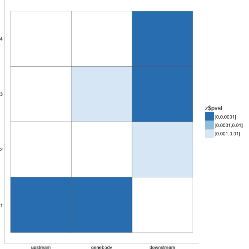

1. Comparsion between [#CG methylation/# CG for which you have 4x coverage] AND [#CG methylation/# CG for which you have 4x coverage]/# CG in this 20 bp bin

2. Emailed Denis about which test we should be using for nonparamtic anova, and posthoc test along with correcting for multiple testing... : The Kruskal-Wallis test should be enough, you do not need to use the Wilcoxon/Spearman test unless you want to find exactly which pairs are statistically different. Also, you do not need to correct for multiple comparisons when using Kruskal-Wallis test (or ANOVA). 
FYI, if you decided to use the Wilcoxon test, then the correction for multiple comparisons would be necessary, since you would need to run multiple tests between the expression quartiles.

3. sliding window anova... of 20 bins (100bp regions) for R,V,N,S to determine which region is contributng more (SEE correlation plot at end of CG section)

4. Extract genes from these regions and run go analysis?! 


NOTES
=====

1. Fix alignment of data... DONE (/Users/gturco/Documents/code/Brady/bs_seq_analysis/genic_analysis/reformat_genedata.py)
2. Change this in anova script... DONE
3. run anova script on all plots make heatmap at bottom of each section... have third column for RPKM or Tissue.. DONE
4. add to this...... DONE
5. Make another correlation graph for bigger data similar to Siobhans for Peter: .... DONE


CG Methylation RPKM 1->4
========================================================

#CG methylation/# CG for which you have 4x coverage


```r
library(ggplot2)
library(grid)

file_name = "/Users/gturco/Documents/Data/Sorg/TSS/rpkm_new/tissue/Tissue/CG_all_1.txt"
x = read.table(file_name, col.names=c("pos","freq","mtype"))
x$mtype <- factor(x$mtype, levels = c("root","shoot","vascular","nonvascular"))
ggplot(data=x, 
       aes(x = pos, y = freq * 100 ,group=mtype, color = mtype)) +  geom_line(size = .3) +
  theme_classic() + theme(text=element_text(size=20))    +  theme(legend.position ="none", text=element_text(size=7), panel.margin = unit(0, "cm"), plot.margin = unit(c(0, 0, 0.01, -0.1), "cm"),axis.ticks = element_line(size = 0.1), axis.line = element_line(size = 0.1), axis.ticks.length = unit(0.05, "cm"), axis.ticks.margin =unit(0, "cm")) + xlab(NULL) + ylab("% Methylation") + scale_colour_manual(values=c("#c6141c","#fccb0c","#009987","#3261a8")) + ylim(14,84)
```

```
## Warning: `axis.ticks.margin` is deprecated. Please set `margin` property of
## `axis.text` instead
```


Are these changes significant


```r
library(PMCMR)
kruskal.test(freq ~ mtype, data = x) 
```

```
## 
## 	Kruskal-Wallis rank sum test
## 
## data:  freq by mtype
## Kruskal-Wallis chi-squared = 24.999, df = 3, p-value = 1.545e-05
```

```r
posthoc.kruskal.nemenyi.test(freq ~ mtype, data=x, dist="Tukey")
```

```
## 
## 	Pairwise comparisons using Tukey and Kramer (Nemenyi) test	
##                    with Tukey-Dist approximation for independent samples 
## 
## data:  freq by mtype 
## 
##             root    shoot  vascular
## shoot       5.8e-06 -      -       
## vascular    0.1653  0.0238 -       
## nonvascular 0.3879  0.0051 0.9637  
## 
## P value adjustment method: none
```

[#CG methylation/# CG for which you have 4x coverage]/# CG in this 20 bp bin


```r
file_name = "/Users/gturco/Documents/Data/Sorg/11_25_2015/dist_data/TSS_cs_plots/Tissue/CG/CG_1.txt"
x = read.table(file_name, col.names=c("pos","freq","mtype"))
x$mtype <- factor(x$mtype, levels = c("Root","Shoot","Vascular","Nonvascular"))
ggplot(data=x, 
       aes(x = pos, y = freq * 100 ,group=mtype, color = mtype)) +  geom_line(size = .3) +
  theme_classic() + theme(text=element_text(size=20))    +  theme(legend.position ="none", text=element_text(size=7), panel.margin = unit(0, "cm"), plot.margin = unit(c(0, 0, 0.01, -0.1), "cm"),axis.ticks = element_line(size = 0.1), axis.line = element_line(size = 0.1), axis.ticks.length = unit(0.05, "cm"), axis.ticks.margin =unit(0, "cm")) + xlab(NULL) + ylab("% Methylation") + scale_colour_manual(values=c("#c6141c","#fccb0c","#009987","#3261a8"))
```

```
## Warning: `axis.ticks.margin` is deprecated. Please set `margin` property of
## `axis.text` instead
```


```r
library(PMCMR)
kruskal.test(freq ~ mtype, data = x) 
```

```
## 
## 	Kruskal-Wallis rank sum test
## 
## data:  freq by mtype
## Kruskal-Wallis chi-squared = 17.073, df = 3, p-value = 0.0006828
```

```r
posthoc.kruskal.nemenyi.test(freq ~ mtype, data=x, dist="Tukey")
```

```
## 
## 	Pairwise comparisons using Tukey and Kramer (Nemenyi) test	
##                    with Tukey-Dist approximation for independent samples 
## 
## data:  freq by mtype 
## 
##             Root    Shoot   Vascular
## Shoot       0.00068 -       -       
## Vascular    0.88974 0.00944 -       
## Nonvascular 0.71029 0.02756 0.98560 
## 
## P value adjustment method: none
```


```r
file_name = "/Users/gturco/Documents/Data/Sorg/TSS/rpkm_new/tissue/Tissue/CG_all_2.txt"
x = read.table(file_name, col.names=c("pos","freq","mtype"))
x$mtype <- factor(x$mtype, levels = c("root","shoot","vascular","nonvascular"))
ggplot(data=x, aes(x = pos, y = freq * 100 ,group=mtype, color = mtype)) +  geom_line(size = .3) +
  theme_classic() + theme(text=element_text(size=20))    +  theme(legend.position ="none", text=element_text(size=7), panel.margin = unit(0, "cm"), plot.margin = unit(c(0, 0, 0.01, -0.1), "cm"),axis.ticks = element_line(size = 0.1), axis.line = element_line(size = 0.1), axis.ticks.length = unit(0.05, "cm"), axis.ticks.margin =unit(0, "cm")) + xlab(NULL) + ylab("% Methylation") + scale_colour_manual(values=c("#c6141c","#fccb0c","#009987","#3261a8")) + ylim(14,84)
```

```
## Warning: `axis.ticks.margin` is deprecated. Please set `margin` property of
## `axis.text` instead
```




```r
file_name = "/Users/gturco/Documents/code/Brady/bs_seq_analysis/genic_analysis/sig_heatmaps/CG_all_2.txt"
y = read.table(file_name ,sep='\t',header=TRUE)
colnames(y) <- c("pos","sig","mtype")
y$pval <- cut(y$sig, breaks = c(-Inf, 0.001, 0.005, 0.05, 1))
ggplot(y, aes(pos, "", fill = pval)) + geom_tile() + scale_fill_brewer(palette = "Greens",direction=-1)  +
  theme_classic() + theme(text=element_text(size=20))    +  
  theme(text=element_text(size=7), panel.margin = unit(0, "cm"), 
        plot.margin = unit(c(0, 0, 0.01, -0.1), "cm"),axis.ticks = element_line(size = 0.1), 
        axis.line = element_line(size = 0.1), axis.ticks.length = unit(0.05, "cm"), axis.ticks.margin =unit(0, "cm")) + 
  xlab(NULL) + ylab(NULL) 
```

```
## Warning: `axis.ticks.margin` is deprecated. Please set `margin` property of
## `axis.text` instead
```


  


Are these changes significant


```r
kruskal.test(freq ~ mtype, data = x) 
```

```
## 
## 	Kruskal-Wallis rank sum test
## 
## data:  freq by mtype
## Kruskal-Wallis chi-squared = 2.1403, df = 3, p-value = 0.5438
```

```r
posthoc.kruskal.nemenyi.test(freq ~ mtype, data=x, dist="Tukey")
```

```
## Warning in posthoc.kruskal.nemenyi.test.default(c(0.460355191257,
## 0.530640373198, : Ties are present, p-values are not corrected.
```

```
## 
## 	Pairwise comparisons using Tukey and Kramer (Nemenyi) test	
##                    with Tukey-Dist approximation for independent samples 
## 
## data:  freq by mtype 
## 
##             root shoot vascular
## shoot       0.92 -     -       
## vascular    0.99 0.80  -       
## nonvascular 0.85 0.48  0.95    
## 
## P value adjustment method: none
```

[#CG methylation/# CG for which you have 4x coverage]/# CG in this 20 bp bin


```r
file_name = "/Users/gturco/Documents/Data/Sorg/11_25_2015/dist_data/TSS_cs_plots/Tissue/CG/CG_2.txt"
x = read.table(file_name, col.names=c("pos","freq","mtype"))
x$mtype <- factor(x$mtype, levels = c("Root","Shoot","Vascular","Nonvascular"))
ggplot(data=x, 
       aes(x = pos, y = freq * 100 ,group=mtype, color = mtype)) +  geom_line(size = .3) +
  theme_classic() + theme(text=element_text(size=20))    +  theme(legend.position ="none", text=element_text(size=7), panel.margin = unit(0, "cm"), plot.margin = unit(c(0, 0, 0.01, -0.1), "cm"),axis.ticks = element_line(size = 0.1), axis.line = element_line(size = 0.1), axis.ticks.length = unit(0.05, "cm"), axis.ticks.margin =unit(0, "cm")) + xlab(NULL) + ylab("% Methylation") + scale_colour_manual(values=c("#c6141c","#fccb0c","#009987","#3261a8"))
```

```
## Warning: `axis.ticks.margin` is deprecated. Please set `margin` property of
## `axis.text` instead
```


```r
library(PMCMR)
kruskal.test(freq ~ mtype, data = x) 
```

```
## 
## 	Kruskal-Wallis rank sum test
## 
## data:  freq by mtype
## Kruskal-Wallis chi-squared = 1.4953, df = 3, p-value = 0.6834
```

```r
posthoc.kruskal.nemenyi.test(freq ~ mtype, data=x, dist="Tukey")
```

```
## 
## 	Pairwise comparisons using Tukey and Kramer (Nemenyi) test	
##                    with Tukey-Dist approximation for independent samples 
## 
## data:  freq by mtype 
## 
##             Root Shoot Vascular
## Shoot       0.99 -     -       
## Vascular    1.00 0.98  -       
## Nonvascular 0.83 0.64  0.86    
## 
## P value adjustment method: none
```


```r
file_name = "/Users/gturco/Documents/Data/Sorg/TSS/rpkm_new/tissue/Tissue/CG_all_3.txt"
x = read.table(file_name, col.names=c("pos","freq","mtype"))
x$mtype <- factor(x$mtype, levels = c("root","shoot","vascular","nonvascular"))
ggplot(data=x, aes(x = pos, y = freq * 100 ,group=mtype, color = mtype)) +  geom_line(size = .3) +
  theme_classic() + theme(text=element_text(size=20))    +  theme(legend.position ="none", text=element_text(size=7), panel.margin = unit(0, "cm"), plot.margin = unit(c(0, 0, 0.01, -0.1), "cm"),axis.ticks = element_line(size = 0.1), axis.line = element_line(size = 0.1), axis.ticks.length = unit(0.05, "cm"), axis.ticks.margin =unit(0, "cm")) + xlab(NULL) + ylab("% Methylation") + scale_colour_manual(values=c("#c6141c","#fccb0c","#009987","#3261a8")) + ylim(14,84)
```

```
## Warning: `axis.ticks.margin` is deprecated. Please set `margin` property of
## `axis.text` instead
```


Are these changes significant


```r
kruskal.test(freq ~ mtype, data = x) 
```

```
## 
## 	Kruskal-Wallis rank sum test
## 
## data:  freq by mtype
## Kruskal-Wallis chi-squared = 5.6211, df = 3, p-value = 0.1316
```

```r
posthoc.kruskal.nemenyi.test(freq ~ mtype, data=x, dist="Tukey")
```

```
## Warning in posthoc.kruskal.nemenyi.test.default(c(0.294576160878,
## 0.203114554847, : Ties are present, p-values are not corrected.
```

```
## 
## 	Pairwise comparisons using Tukey and Kramer (Nemenyi) test	
##                    with Tukey-Dist approximation for independent samples 
## 
## data:  freq by mtype 
## 
##             root shoot vascular
## shoot       0.61 -     -       
## vascular    0.71 0.10  -       
## nonvascular 0.97 0.33  0.93    
## 
## P value adjustment method: none
```

[#CG methylation/# CG for which you have 4x coverage]/# CG in this 20 bp bin


```r
file_name = "/Users/gturco/Documents/Data/Sorg/11_25_2015/dist_data/TSS_cs_plots/Tissue/CG/CG_3.txt"
x = read.table(file_name, col.names=c("pos","freq","mtype"))
x$mtype <- factor(x$mtype, levels = c("Root","Shoot","Vascular","Nonvascular"))
ggplot(data=x, 
       aes(x = pos, y = freq * 100 ,group=mtype, color = mtype)) +  geom_line(size = .3) +
  theme_classic() + theme(text=element_text(size=20))    +  theme(legend.position ="none", text=element_text(size=7), panel.margin = unit(0, "cm"), plot.margin = unit(c(0, 0, 0.01, -0.1), "cm"),axis.ticks = element_line(size = 0.1), axis.line = element_line(size = 0.1), axis.ticks.length = unit(0.05, "cm"), axis.ticks.margin =unit(0, "cm")) + xlab(NULL) + ylab("% Methylation") + scale_colour_manual(values=c("#c6141c","#fccb0c","#009987","#3261a8"))
```

```
## Warning: `axis.ticks.margin` is deprecated. Please set `margin` property of
## `axis.text` instead
```


```r
library(PMCMR)
kruskal.test(freq ~ mtype, data = x) 
```

```
## 
## 	Kruskal-Wallis rank sum test
## 
## data:  freq by mtype
## Kruskal-Wallis chi-squared = 3.8364, df = 3, p-value = 0.2797
```

```r
posthoc.kruskal.nemenyi.test(freq ~ mtype, data=x, dist="Tukey")
```

```
## 
## 	Pairwise comparisons using Tukey and Kramer (Nemenyi) test	
##                    with Tukey-Dist approximation for independent samples 
## 
## data:  freq by mtype 
## 
##             Root Shoot Vascular
## Shoot       0.59 -     -       
## Vascular    0.96 0.28  -       
## Nonvascular 0.99 0.39  1.00    
## 
## P value adjustment method: none
```


```r
file_name = "/Users/gturco/Documents/Data/Sorg/TSS/rpkm_new/tissue/Tissue/CG_all_4.txt"
x = read.table(file_name, col.names=c("pos","freq","mtype"))
x$mtype <- factor(x$mtype, levels = c("root","shoot","vascular","nonvascular"))
ggplot(data=x, aes(x = pos, y = freq * 100 ,group=mtype, color = mtype)) +  geom_line(size = .3) +
  theme_classic() + theme(text=element_text(size=20))    +  theme(legend.position ="none", text=element_text(size=7), panel.margin = unit(0, "cm"), plot.margin = unit(c(0, 0, 0.01, -0.1), "cm"),axis.ticks = element_line(size = 0.1), axis.line = element_line(size = 0.1), axis.ticks.length = unit(0.05, "cm"), axis.ticks.margin =unit(0, "cm")) + xlab(NULL) + ylab("% Methylation") + scale_colour_manual(values=c("#c6141c","#fccb0c","#009987","#3261a8")) + ylim(14,84)
```

```
## Warning: `axis.ticks.margin` is deprecated. Please set `margin` property of
## `axis.text` instead
```


```r
file_name = "/Users/gturco/Documents/code/Brady/bs_seq_analysis/genic_analysis/sig_heatmaps/CG_all_4.txt"
y = read.table(file_name ,sep='\t',header=TRUE)
colnames(y) <- c("pos","sig","mtype")
y$pval <- cut(y$sig, breaks = c(-Inf, 0.001, 0.005, 0.05, 1))
ggplot(y, aes(pos, "", fill = pval)) + geom_tile() + scale_fill_brewer(palette = "Greens",direction=-1)  +
  theme_classic() + theme(text=element_text(size=20))    +  
  theme(text=element_text(size=7), panel.margin = unit(0, "cm"), 
        plot.margin = unit(c(0, 0, 0.01, -0.1), "cm"),axis.ticks = element_line(size = 0.1), 
        axis.line = element_line(size = 0.1), axis.ticks.length = unit(0.05, "cm"), axis.ticks.margin =unit(0, "cm")) + 
  xlab(NULL) + ylab(NULL) 
```

```
## Warning: `axis.ticks.margin` is deprecated. Please set `margin` property of
## `axis.text` instead
```


  


Are these changes significant


```r
kruskal.test(freq ~ mtype, data = x) 
```

```
## 
## 	Kruskal-Wallis rank sum test
## 
## data:  freq by mtype
## Kruskal-Wallis chi-squared = 12.08, df = 3, p-value = 0.007113
```

```r
posthoc.kruskal.nemenyi.test(freq ~ mtype, data=x, dist="Tukey")
```

```
## 
## 	Pairwise comparisons using Tukey and Kramer (Nemenyi) test	
##                    with Tukey-Dist approximation for independent samples 
## 
## data:  freq by mtype 
## 
##             root  shoot vascular
## shoot       0.905 -     -       
## vascular    0.011 0.074 -       
## nonvascular 0.110 0.394 0.833   
## 
## P value adjustment method: none
```

[#CG methylation/# CG for which you have 4x coverage]/# CG in this 20 bp bin


```r
file_name = "/Users/gturco/Documents/Data/Sorg/11_25_2015/dist_data/TSS_cs_plots/Tissue/CG/CG_4.txt"
x = read.table(file_name, col.names=c("pos","freq","mtype"))
x$mtype <- factor(x$mtype, levels = c("Root","Shoot","Vascular","Nonvascular"))
ggplot(data=x, 
       aes(x = pos, y = freq * 100 ,group=mtype, color = mtype)) +  geom_line(size = .3) +
  theme_classic() + theme(text=element_text(size=20))    +  theme(legend.position ="none", text=element_text(size=7), panel.margin = unit(0, "cm"), plot.margin = unit(c(0, 0, 0.01, -0.1), "cm"),axis.ticks = element_line(size = 0.1), axis.line = element_line(size = 0.1), axis.ticks.length = unit(0.05, "cm"), axis.ticks.margin =unit(0, "cm")) + xlab(NULL) + ylab("% Methylation") + scale_colour_manual(values=c("#c6141c","#fccb0c","#009987","#3261a8"))
```

```
## Warning: `axis.ticks.margin` is deprecated. Please set `margin` property of
## `axis.text` instead
```


```r
library(PMCMR)
kruskal.test(freq ~ mtype, data = x) 
```

```
## 
## 	Kruskal-Wallis rank sum test
## 
## data:  freq by mtype
## Kruskal-Wallis chi-squared = 7.875, df = 3, p-value = 0.04867
```

```r
posthoc.kruskal.nemenyi.test(freq ~ mtype, data=x, dist="Tukey")
```

```
## 
## 	Pairwise comparisons using Tukey and Kramer (Nemenyi) test	
##                    with Tukey-Dist approximation for independent samples 
## 
## data:  freq by mtype 
## 
##             Root  Shoot Vascular
## Shoot       0.952 -     -       
## Vascular    0.065 0.211 -       
## Nonvascular 0.246 0.543 0.929   
## 
## P value adjustment method: none
```


```r
file_name = "/Users/gturco/Documents/code/Brady/bs_seq_analysis/genic_analysis/sig_heatmaps/CG_all.txt"
y = read.table(file_name ,sep='\t',header=TRUE)
colnames(y) <- c("pos","sig","mtype")
y$pval <- cut(y$sig, breaks = c(-Inf, 0.001, 0.005, 0.05, 1))
ggplot(y, aes(pos, mtype, fill = pval)) + geom_tile() + scale_fill_brewer(palette = "Greens",direction=-1)  +
  theme_classic() + theme(text=element_text(size=20))    +  
  theme(text=element_text(size=12), panel.margin = unit(0, "cm"), 
        plot.margin = unit(c(0, 0, 0.01, -0.1), "cm"),axis.ticks = element_line(size = 0.1), 
        axis.line = element_line(size = 0.1), axis.ticks.length = unit(0.05, "cm"), axis.ticks.margin =unit(0, "cm")) + 
  xlab(NULL) + ylab(NULL) 
```

```
## Warning: `axis.ticks.margin` is deprecated. Please set `margin` property of
## `axis.text` instead
```


  

```r
file_name = "/Users/gturco/Documents/code/Brady/bs_seq_analysis/genic_analysis/sig_heatmaps/strict/CG_all.txt"
y = read.table(file_name ,sep='\t',header=TRUE)
colnames(y) <- c("pos","sig","mtype")
y$pval <- cut(y$sig, breaks = c(-Inf, 0.001, 0.005, 0.05, 1))
ggplot(y, aes(pos, mtype, fill = pval)) + geom_tile() + scale_fill_brewer(palette = "Greens",direction=-1)  +
  theme_classic() + theme(text=element_text(size=20))    +  
  theme(text=element_text(size=12), panel.margin = unit(0, "cm"), 
        plot.margin = unit(c(0, 0, 0.01, -0.1), "cm"),axis.ticks = element_line(size = 0.1), 
        axis.line = element_line(size = 0.1), axis.ticks.length = unit(0.05, "cm"), axis.ticks.margin =unit(0, "cm")) + 
  xlab(NULL) + ylab(NULL) 
```

```
## Warning: `axis.ticks.margin` is deprecated. Please set `margin` property of
## `axis.text` instead
```


CHG Methylation RPKM 1->4
========================================================


```r
file_name = "/Users/gturco/Documents/Data/Sorg/TSS/rpkm_new/tissue/Tissue/CHG_all_1.txt"
x = read.table(file_name, col.names=c("pos","freq","mtype"))
x$mtype <- factor(x$mtype, levels = c("root","shoot","vascular","nonvascular"))
ggplot(data=x, aes(x = pos, y = freq * 100 ,group=mtype, color = mtype)) +  geom_line(size = .3) +
  theme_classic() + theme(text=element_text(size=20))    +  theme(legend.position ="none", text=element_text(size=7), panel.margin = unit(0, "cm"), plot.margin = unit(c(0, 0, 0.01, -0.1), "cm"),axis.ticks = element_line(size = 0.1), axis.line = element_line(size = 0.1), axis.ticks.length = unit(0.05, "cm"), axis.ticks.margin =unit(0, "cm")) + xlab(NULL) + ylab("") + scale_colour_manual(values=c("#c6141c","#fccb0c","#009987","#3261a8")) + ylim(5,35)
```

```
## Warning: `axis.ticks.margin` is deprecated. Please set `margin` property of
## `axis.text` instead
```


Are these changes significant


```r
kruskal.test(freq ~ mtype, data = x) 
```

```
## 
## 	Kruskal-Wallis rank sum test
## 
## data:  freq by mtype
## Kruskal-Wallis chi-squared = 12.648, df = 3, p-value = 0.005462
```

```r
posthoc.kruskal.nemenyi.test(freq ~ mtype, data=x, dist="Tukey")
```

```
## 
## 	Pairwise comparisons using Tukey and Kramer (Nemenyi) test	
##                    with Tukey-Dist approximation for independent samples 
## 
## data:  freq by mtype 
## 
##             root  shoot vascular
## shoot       0.409 -     -       
## vascular    0.003 0.222 -       
## nonvascular 0.733 0.955 0.071   
## 
## P value adjustment method: none
```


[#CG methylation/# CG for which you have 4x coverage]/# CG in this 20 bp bin


```r
file_name = "/Users/gturco/Documents/Data/Sorg/11_25_2015/dist_data/TSS_cs_plots/Tissue/CHG/CHG_1.txt"
x = read.table(file_name, col.names=c("pos","freq","mtype"))
x$mtype <- factor(x$mtype, levels = c("Root","Shoot","Vascular","Nonvascular"))
ggplot(data=x, 
       aes(x = pos, y = freq * 100 ,group=mtype, color = mtype)) +  geom_line(size = .3) +
  theme_classic() + theme(text=element_text(size=20))    +  theme(legend.position ="none", text=element_text(size=7), panel.margin = unit(0, "cm"), plot.margin = unit(c(0, 0, 0.01, -0.1), "cm"),axis.ticks = element_line(size = 0.1), axis.line = element_line(size = 0.1), axis.ticks.length = unit(0.05, "cm"), axis.ticks.margin =unit(0, "cm")) + xlab(NULL) + ylab("% Methylation") + scale_colour_manual(values=c("#c6141c","#fccb0c","#009987","#3261a8"))
```

```
## Warning: `axis.ticks.margin` is deprecated. Please set `margin` property of
## `axis.text` instead
```


```r
library(PMCMR)
kruskal.test(freq ~ mtype, data = x) 
```

```
## 
## 	Kruskal-Wallis rank sum test
## 
## data:  freq by mtype
## Kruskal-Wallis chi-squared = 12.364, df = 3, p-value = 0.006235
```

```r
posthoc.kruskal.nemenyi.test(freq ~ mtype, data=x, dist="Tukey")
```

```
## 
## 	Pairwise comparisons using Tukey and Kramer (Nemenyi) test	
##                    with Tukey-Dist approximation for independent samples 
## 
## data:  freq by mtype 
## 
##             Root  Shoot Vascular
## Shoot       0.151 -     -       
## Vascular    0.935 0.035 -       
## Nonvascular 0.123 1.000 0.027   
## 
## P value adjustment method: none
```


```r
file_name = "/Users/gturco/Documents/Data/Sorg/TSS/rpkm_new/tissue/Tissue/CHG_all_2.txt"
x = read.table(file_name, col.names=c("pos","freq","mtype"))
x$mtype <- factor(x$mtype, levels = c("root","shoot","vascular","nonvascular"))
ggplot(data=x, aes(x = pos, y = freq * 100 ,group=mtype, color = mtype)) +  geom_line(size = .3) +
  theme_classic() + theme(text=element_text(size=20))    +  theme(legend.position ="none", text=element_text(size=7), panel.margin = unit(0, "cm"), plot.margin = unit(c(0, 0, 0.01, -0.1), "cm"),axis.ticks = element_line(size = 0.1), axis.line = element_line(size = 0.1), axis.ticks.length = unit(0.05, "cm"), axis.ticks.margin =unit(0, "cm")) + xlab(NULL) + ylab("") + scale_colour_manual(values=c("#c6141c","#fccb0c","#009987","#3261a8")) + ylim(5,35)
```

```
## Warning: `axis.ticks.margin` is deprecated. Please set `margin` property of
## `axis.text` instead
```


Are these changes significant


```r
kruskal.test(freq ~ mtype, data = x) 
```

```
## 
## 	Kruskal-Wallis rank sum test
## 
## data:  freq by mtype
## Kruskal-Wallis chi-squared = 9.0673, df = 3, p-value = 0.02841
```

```r
posthoc.kruskal.nemenyi.test(freq ~ mtype, data=x, dist="Tukey")
```

```
## 
## 	Pairwise comparisons using Tukey and Kramer (Nemenyi) test	
##                    with Tukey-Dist approximation for independent samples 
## 
## data:  freq by mtype 
## 
##             root  shoot vascular
## shoot       1.000 -     -       
## vascular    0.047 0.050 -       
## nonvascular 0.610 0.629 0.519   
## 
## P value adjustment method: none
```


[#CG methylation/# CG for which you have 4x coverage]/# CG in this 20 bp bin


```r
file_name = "/Users/gturco/Documents/Data/Sorg/11_25_2015/dist_data/TSS_cs_plots/Tissue/CHG/CHG_2.txt"
x = read.table(file_name, col.names=c("pos","freq","mtype"))
x$mtype <- factor(x$mtype, levels = c("Root","Shoot","Vascular","Nonvascular"))
ggplot(data=x, 
       aes(x = pos, y = freq * 100 ,group=mtype, color = mtype)) +  geom_line(size = .3) +
  theme_classic() + theme(text=element_text(size=20))    +  theme(legend.position ="none", text=element_text(size=7), panel.margin = unit(0, "cm"), plot.margin = unit(c(0, 0, 0.01, -0.1), "cm"),axis.ticks = element_line(size = 0.1), axis.line = element_line(size = 0.1), axis.ticks.length = unit(0.05, "cm"), axis.ticks.margin =unit(0, "cm")) + xlab(NULL) + ylab("% Methylation") + scale_colour_manual(values=c("#c6141c","#fccb0c","#009987","#3261a8"))
```

```
## Warning: `axis.ticks.margin` is deprecated. Please set `margin` property of
## `axis.text` instead
```


```r
library(PMCMR)
kruskal.test(freq ~ mtype, data = x) 
```

```
## 
## 	Kruskal-Wallis rank sum test
## 
## data:  freq by mtype
## Kruskal-Wallis chi-squared = 15.248, df = 3, p-value = 0.001617
```

```r
posthoc.kruskal.nemenyi.test(freq ~ mtype, data=x, dist="Tukey")
```

```
## 
## 	Pairwise comparisons using Tukey and Kramer (Nemenyi) test	
##                    with Tukey-Dist approximation for independent samples 
## 
## data:  freq by mtype 
## 
##             Root   Shoot  Vascular
## Shoot       0.0019 -      -       
## Vascular    0.9546 0.0114 -       
## Nonvascular 0.3141 0.2399 0.6272  
## 
## P value adjustment method: none
```


```r
file_name = "/Users/gturco/Documents/Data/Sorg/TSS/rpkm_new/tissue/Tissue/CHG_all_3.txt"
x = read.table(file_name, col.names=c("pos","freq","mtype"))
x$mtype <- factor(x$mtype, levels = c("root","shoot","vascular","nonvascular"))
ggplot(data=x, aes(x = pos, y = freq * 100 ,group=mtype, color = mtype)) +  geom_line(size = .3) +
  theme_classic() + theme(text=element_text(size=20))    +  theme(legend.position ="none", text=element_text(size=7), panel.margin = unit(0, "cm"), plot.margin = unit(c(0, 0, 0.01, -0.1), "cm"),axis.ticks = element_line(size = 0.1), axis.line = element_line(size = 0.1), axis.ticks.length = unit(0.05, "cm"), axis.ticks.margin =unit(0, "cm")) + xlab(NULL) + ylab("") + scale_colour_manual(values=c("#c6141c","#fccb0c","#009987","#3261a8")) + ylim(5,35)
```

```
## Warning: `axis.ticks.margin` is deprecated. Please set `margin` property of
## `axis.text` instead
```


Are these changes significant


```r
kruskal.test(freq ~ mtype, data = x) 
```

```
## 
## 	Kruskal-Wallis rank sum test
## 
## data:  freq by mtype
## Kruskal-Wallis chi-squared = 15.48, df = 3, p-value = 0.001449
```

```r
posthoc.kruskal.nemenyi.test(freq ~ mtype, data=x, dist="Tukey")
```

```
## 
## 	Pairwise comparisons using Tukey and Kramer (Nemenyi) test	
##                    with Tukey-Dist approximation for independent samples 
## 
## data:  freq by mtype 
## 
##             root   shoot  vascular
## shoot       0.9719 -      -       
## vascular    0.0299 0.0077 -       
## nonvascular 0.0982 0.0315 0.9685  
## 
## P value adjustment method: none
```


[#CG methylation/# CG for which you have 4x coverage]/# CG in this 20 bp bin


```r
file_name = "/Users/gturco/Documents/Data/Sorg/11_25_2015/dist_data/TSS_cs_plots/Tissue/CHG/CHG_3.txt"
x = read.table(file_name, col.names=c("pos","freq","mtype"))
x$mtype <- factor(x$mtype, levels = c("Root","Shoot","Vascular","Nonvascular"))
ggplot(data=x, 
       aes(x = pos, y = freq * 100 ,group=mtype, color = mtype)) +  geom_line(size = .3) +
  theme_classic() + theme(text=element_text(size=20))    +  theme(legend.position ="none", text=element_text(size=7), panel.margin = unit(0, "cm"), plot.margin = unit(c(0, 0, 0.01, -0.1), "cm"),axis.ticks = element_line(size = 0.1), axis.line = element_line(size = 0.1), axis.ticks.length = unit(0.05, "cm"), axis.ticks.margin =unit(0, "cm")) + xlab(NULL) + ylab("% Methylation") + scale_colour_manual(values=c("#c6141c","#fccb0c","#009987","#3261a8"))
```

```
## Warning: `axis.ticks.margin` is deprecated. Please set `margin` property of
## `axis.text` instead
```


```r
library(PMCMR)
kruskal.test(freq ~ mtype, data = x) 
```

```
## 
## 	Kruskal-Wallis rank sum test
## 
## data:  freq by mtype
## Kruskal-Wallis chi-squared = 17.61, df = 3, p-value = 0.0005292
```

```r
posthoc.kruskal.nemenyi.test(freq ~ mtype, data=x, dist="Tukey")
```

```
## 
## 	Pairwise comparisons using Tukey and Kramer (Nemenyi) test	
##                    with Tukey-Dist approximation for independent samples 
## 
## data:  freq by mtype 
## 
##             Root   Shoot  Vascular
## Shoot       0.0015 -      -       
## Vascular    0.9875 0.0051 -       
## Nonvascular 0.9835 0.0058 1.0000  
## 
## P value adjustment method: none
```


```r
file_name = "/Users/gturco/Documents/Data/Sorg/TSS/rpkm_new/tissue/Tissue/CHG_all_4.txt"
x = read.table(file_name, col.names=c("pos","freq","mtype"))
x$mtype <- factor(x$mtype, levels = c("root","shoot","vascular","nonvascular"))
ggplot(data=x, aes(x = pos, y = freq * 100 ,group=mtype, color = mtype)) +  geom_line(size = .3) +
  theme_classic() + theme(text=element_text(size=20))    +  theme(legend.position ="none", text=element_text(size=7), panel.margin = unit(0, "cm"), plot.margin = unit(c(0, 0, 0.01, -0.1), "cm"),axis.ticks = element_line(size = 0.1), axis.line = element_line(size = 0.1), axis.ticks.length = unit(0.05, "cm"), axis.ticks.margin =unit(0, "cm")) + xlab(NULL) + ylab("") + scale_colour_manual(values=c("#c6141c","#fccb0c","#009987","#3261a8")) + ylim(5,35)
```

```
## Warning: `axis.ticks.margin` is deprecated. Please set `margin` property of
## `axis.text` instead
```


Are these changes significant


```r
kruskal.test(freq ~ mtype, data = x) 
```

```
## 
## 	Kruskal-Wallis rank sum test
## 
## data:  freq by mtype
## Kruskal-Wallis chi-squared = 17.62, df = 3, p-value = 0.0005268
```

```r
posthoc.kruskal.nemenyi.test(freq ~ mtype, data=x, dist="Tukey")
```

```
## 
## 	Pairwise comparisons using Tukey and Kramer (Nemenyi) test	
##                    with Tukey-Dist approximation for independent samples 
## 
## data:  freq by mtype 
## 
##             root   shoot  vascular
## shoot       0.9913 -      -       
## vascular    0.0018 0.0052 -       
## nonvascular 0.0899 0.1721 0.5852  
## 
## P value adjustment method: none
```


[#CG methylation/# CG for which you have 4x coverage]/# CG in this 20 bp bin


```r
file_name = "/Users/gturco/Documents/Data/Sorg/11_25_2015/dist_data/TSS_cs_plots/Tissue/CHG/CHG_4.txt"
x = read.table(file_name, col.names=c("pos","freq","mtype"))
x$mtype <- factor(x$mtype, levels = c("Root","Shoot","Vascular","Nonvascular"))
ggplot(data=x, 
       aes(x = pos, y = freq * 100 ,group=mtype, color = mtype)) +  geom_line(size = .3) +
  theme_classic() + theme(text=element_text(size=20))    +  theme(legend.position ="none", text=element_text(size=7), panel.margin = unit(0, "cm"), plot.margin = unit(c(0, 0, 0.01, -0.1), "cm"),axis.ticks = element_line(size = 0.1), axis.line = element_line(size = 0.1), axis.ticks.length = unit(0.05, "cm"), axis.ticks.margin =unit(0, "cm")) + xlab(NULL) + ylab("% Methylation") + scale_colour_manual(values=c("#c6141c","#fccb0c","#009987","#3261a8"))
```

```
## Warning: `axis.ticks.margin` is deprecated. Please set `margin` property of
## `axis.text` instead
```


```r
library(PMCMR)
kruskal.test(freq ~ mtype, data = x) 
```

```
## 
## 	Kruskal-Wallis rank sum test
## 
## data:  freq by mtype
## Kruskal-Wallis chi-squared = 11.609, df = 3, p-value = 0.008849
```

```r
posthoc.kruskal.nemenyi.test(freq ~ mtype, data=x, dist="Tukey")
```

```
## 
## 	Pairwise comparisons using Tukey and Kramer (Nemenyi) test	
##                    with Tukey-Dist approximation for independent samples 
## 
## data:  freq by mtype 
## 
##             Root   Shoot  Vascular
## Shoot       0.0903 -      -       
## Vascular    0.7849 0.0059 -       
## Nonvascular 0.9999 0.1025 0.7547  
## 
## P value adjustment method: none
```


```r
file_name = "/Users/gturco/Documents/code/Brady/bs_seq_analysis/genic_analysis/sig_heatmaps/CHG_all.txt"
y = read.table(file_name ,sep='\t',header=TRUE)
colnames(y) <- c("pos","sig","mtype")
y$pval <- cut(y$sig, breaks = c(-Inf, 0.001, 0.005, 0.05, 1))
ggplot(y, aes(pos, mtype, fill = pval)) + geom_tile() + scale_fill_brewer(palette = "Greens",direction=-1)  +
  theme_classic() + theme(text=element_text(size=20))    +  
  theme(text=element_text(size=12), panel.margin = unit(0, "cm"), 
        plot.margin = unit(c(0, 0, 0.01, -0.1), "cm"),axis.ticks = element_line(size = 0.1), 
        axis.line = element_line(size = 0.1), axis.ticks.length = unit(0.05, "cm"), axis.ticks.margin =unit(0, "cm")) + 
  xlab(NULL) + ylab(NULL) 
```

```
## Warning: `axis.ticks.margin` is deprecated. Please set `margin` property of
## `axis.text` instead
```


  

```r
file_name = "/Users/gturco/Documents/code/Brady/bs_seq_analysis/genic_analysis/sig_heatmaps/strict/CHG_all.txt"
y = read.table(file_name ,sep='\t',header=TRUE)
colnames(y) <- c("pos","sig","mtype")
y$pval <- cut(y$sig, breaks = c(-Inf, 0.001, 0.005, 0.05, 1))
ggplot(y, aes(pos, mtype, fill = pval)) + geom_tile() + scale_fill_brewer(palette = "Greens",direction=-1)  +
  theme_classic() + theme(text=element_text(size=20))    +  
  theme(text=element_text(size=12), panel.margin = unit(0, "cm"), 
        plot.margin = unit(c(0, 0, 0.01, -0.1), "cm"),axis.ticks = element_line(size = 0.1), 
        axis.line = element_line(size = 0.1), axis.ticks.length = unit(0.05, "cm"), axis.ticks.margin =unit(0, "cm")) + 
  xlab(NULL) + ylab(NULL) 
```

```
## Warning: `axis.ticks.margin` is deprecated. Please set `margin` property of
## `axis.text` instead
```


CHH Methylation RPKM 1->4
========================================================


```r
file_name = "/Users/gturco/Documents/Data/Sorg/TSS/rpkm_new/tissue/Tissue/CHH_all_1.txt"
x = read.table(file_name, col.names=c("pos","freq","mtype"))
x$mtype <- factor(x$mtype, levels = c("root","shoot","vascular","nonvascular"))
ggplot(data=x, 
       aes(x = pos, y = freq * 100 ,group=mtype, color = mtype)) +  geom_line(size = .3) +
  theme_classic() + theme(text=element_text(size=20))    +  theme(legend.position ="none", text=element_text(size=7), panel.margin = unit(0, "cm"), plot.margin = unit(c(0, 0, 0.01, -0.1), "cm"),axis.ticks = element_line(size = 0.1), axis.line = element_line(size = 0.1), axis.ticks.length = unit(0.05, "cm"), axis.ticks.margin =unit(0, "cm")) + xlab(NULL) + ylab("% methylation") + scale_colour_manual(values=c("#c6141c","#fccb0c","#009987","#3261a8")) + ylim(5,21)
```

```
## Warning: `axis.ticks.margin` is deprecated. Please set `margin` property of
## `axis.text` instead
```


Are these changes significant


```r
kruskal.test(freq ~ mtype, data = x) 
```

```
## 
## 	Kruskal-Wallis rank sum test
## 
## data:  freq by mtype
## Kruskal-Wallis chi-squared = 401.28, df = 3, p-value < 2.2e-16
```

```r
posthoc.kruskal.nemenyi.test(freq ~ mtype, data=x, dist="Tukey")
```

```
## 
## 	Pairwise comparisons using Tukey and Kramer (Nemenyi) test	
##                    with Tukey-Dist approximation for independent samples 
## 
## data:  freq by mtype 
## 
##             root   shoot  vascular
## shoot       1.00   -      -       
## vascular    <2e-16 <2e-16 -       
## nonvascular <2e-16 <2e-16 0.04    
## 
## P value adjustment method: none
```

[#CG methylation/# CG for which you have 4x coverage]/# CG in this 20 bp bin


```r
file_name = "/Users/gturco/Documents/Data/Sorg/11_25_2015/dist_data/TSS_cs_plots/Tissue/CHH/CHH_1.txt"
x = read.table(file_name, col.names=c("pos","freq","mtype"))
x$mtype <- factor(x$mtype, levels = c("Root","Shoot","Vascular","Nonvascular"))
ggplot(data=x, 
       aes(x = pos, y = freq * 100 ,group=mtype, color = mtype)) +  geom_line(size = .3) +
  theme_classic() + theme(text=element_text(size=20))    +  theme(legend.position ="none", text=element_text(size=7), panel.margin = unit(0, "cm"), plot.margin = unit(c(0, 0, 0.01, -0.1), "cm"),axis.ticks = element_line(size = 0.1), axis.line = element_line(size = 0.1), axis.ticks.length = unit(0.05, "cm"), axis.ticks.margin =unit(0, "cm")) + xlab(NULL) + ylab("% Methylation") + scale_colour_manual(values=c("#c6141c","#fccb0c","#009987","#3261a8"))
```

```
## Warning: `axis.ticks.margin` is deprecated. Please set `margin` property of
## `axis.text` instead
```


```r
library(PMCMR)
kruskal.test(freq ~ mtype, data = x) 
```

```
## 
## 	Kruskal-Wallis rank sum test
## 
## data:  freq by mtype
## Kruskal-Wallis chi-squared = 273.17, df = 3, p-value < 2.2e-16
```

```r
posthoc.kruskal.nemenyi.test(freq ~ mtype, data=x, dist="Tukey")
```

```
## 
## 	Pairwise comparisons using Tukey and Kramer (Nemenyi) test	
##                    with Tukey-Dist approximation for independent samples 
## 
## data:  freq by mtype 
## 
##             Root    Shoot   Vascular
## Shoot       0.98    -       -       
## Vascular    4.2e-14 4.0e-14 -       
## Nonvascular < 2e-16 < 2e-16 0.20    
## 
## P value adjustment method: none
```


```r
file_name = "/Users/gturco/Documents/Data/Sorg/TSS/rpkm_new/tissue/Tissue/CHH_all_2.txt"
x = read.table(file_name, col.names=c("pos","freq","mtype"))
x$mtype <- factor(x$mtype, levels = c("root","shoot","vascular","nonvascular"))
ggplot(data=x, aes(x = pos, y = freq * 100 ,group=mtype, color = mtype)) +  geom_line(size = .3) +
  theme_classic() + theme(text=element_text(size=20))    +  theme(legend.position ="none", text=element_text(size=7), panel.margin = unit(0, "cm"), plot.margin = unit(c(0, 0, 0.01, -0.1), "cm"),axis.ticks = element_line(size = 0.1), axis.line = element_line(size = 0.1), axis.ticks.length = unit(0.05, "cm"), axis.ticks.margin =unit(0, "cm")) + xlab(NULL) + ylab("% methylation") + scale_colour_manual(values=c("#c6141c","#fccb0c","#009987","#3261a8")) + ylim(5,21)
```

```
## Warning: `axis.ticks.margin` is deprecated. Please set `margin` property of
## `axis.text` instead
```


Are these changes significant


```r
kruskal.test(freq ~ mtype, data = x) 
```

```
## 
## 	Kruskal-Wallis rank sum test
## 
## data:  freq by mtype
## Kruskal-Wallis chi-squared = 497, df = 3, p-value < 2.2e-16
```

```r
posthoc.kruskal.nemenyi.test(freq ~ mtype, data=x, dist="Tukey")
```

```
## 
## 	Pairwise comparisons using Tukey and Kramer (Nemenyi) test	
##                    with Tukey-Dist approximation for independent samples 
## 
## data:  freq by mtype 
## 
##             root   shoot  vascular
## shoot       0.2100 -      -       
## vascular    <2e-16 <2e-16 -       
## nonvascular <2e-16 <2e-16 0.0019  
## 
## P value adjustment method: none
```


```r
file_name = "/Users/gturco/Documents/Data/Sorg/11_25_2015/dist_data/TSS_cs_plots/Tissue/CHH/CHH_2.txt"
x = read.table(file_name, col.names=c("pos","freq","mtype"))
x$mtype <- factor(x$mtype, levels = c("Root","Shoot","Vascular","Nonvascular"))
ggplot(data=x, 
       aes(x = pos, y = freq * 100 ,group=mtype, color = mtype)) +  geom_line(size = .3) +
  theme_classic() + theme(text=element_text(size=20))    +  theme(legend.position ="none", text=element_text(size=7), panel.margin = unit(0, "cm"), plot.margin = unit(c(0, 0, 0.01, -0.1), "cm"),axis.ticks = element_line(size = 0.1), axis.line = element_line(size = 0.1), axis.ticks.length = unit(0.05, "cm"), axis.ticks.margin =unit(0, "cm")) + xlab(NULL) + ylab("% Methylation") + scale_colour_manual(values=c("#c6141c","#fccb0c","#009987","#3261a8"))
```

```
## Warning: `axis.ticks.margin` is deprecated. Please set `margin` property of
## `axis.text` instead
```


```r
library(PMCMR)
kruskal.test(freq ~ mtype, data = x) 
```

```
## 
## 	Kruskal-Wallis rank sum test
## 
## data:  freq by mtype
## Kruskal-Wallis chi-squared = 472.89, df = 3, p-value < 2.2e-16
```

```r
posthoc.kruskal.nemenyi.test(freq ~ mtype, data=x, dist="Tukey")
```

```
## 
## 	Pairwise comparisons using Tukey and Kramer (Nemenyi) test	
##                    with Tukey-Dist approximation for independent samples 
## 
## data:  freq by mtype 
## 
##             Root   Shoot  Vascular
## Shoot       0.21   -      -       
## Vascular    <2e-16 <2e-16 -       
## Nonvascular <2e-16 <2e-16 0.12    
## 
## P value adjustment method: none
```


```r
file_name = "/Users/gturco/Documents/Data/Sorg/TSS/rpkm_new/tissue/Tissue/CHH_all_3.txt"
x = read.table(file_name, col.names=c("pos","freq","mtype"))
x$mtype <- factor(x$mtype, levels = c("root","shoot","vascular","nonvascular"))
ggplot(data=x, aes(x = pos, y = freq * 100 ,group=mtype, color = mtype)) +  geom_line(size = .3) +
  theme_classic() + theme(text=element_text(size=20))    +  theme(legend.position ="none", text=element_text(size=7), panel.margin = unit(0, "cm"), plot.margin = unit(c(0, 0, 0.01, -0.1), "cm"),axis.ticks = element_line(size = 0.1), axis.line = element_line(size = 0.1), axis.ticks.length = unit(0.05, "cm"), axis.ticks.margin =unit(0, "cm")) + xlab(NULL) + ylab("% methylation") + scale_colour_manual(values=c("#c6141c","#fccb0c","#009987","#3261a8")) + ylim(5,21)
```

```
## Warning: `axis.ticks.margin` is deprecated. Please set `margin` property of
## `axis.text` instead
```


Are these changes significant


```r
kruskal.test(freq ~ mtype, data = x) 
```

```
## 
## 	Kruskal-Wallis rank sum test
## 
## data:  freq by mtype
## Kruskal-Wallis chi-squared = 458.88, df = 3, p-value < 2.2e-16
```

```r
posthoc.kruskal.nemenyi.test(freq ~ mtype, data=x, dist="Tukey")
```

```
## 
## 	Pairwise comparisons using Tukey and Kramer (Nemenyi) test	
##                    with Tukey-Dist approximation for independent samples 
## 
## data:  freq by mtype 
## 
##             root    shoot   vascular
## shoot       0.32    -       -       
## vascular    < 2e-16 < 2e-16 -       
## nonvascular < 2e-16 < 2e-16 5.1e-05 
## 
## P value adjustment method: none
```


```r
file_name = "/Users/gturco/Documents/Data/Sorg/11_25_2015/dist_data/TSS_cs_plots/Tissue/CHH/CHH_3.txt"
x = read.table(file_name, col.names=c("pos","freq","mtype"))
x$mtype <- factor(x$mtype, levels = c("Root","Shoot","Vascular","Nonvascular"))
ggplot(data=x, 
       aes(x = pos, y = freq * 100 ,group=mtype, color = mtype)) +  geom_line(size = .3) +
  theme_classic() + theme(text=element_text(size=20))    +  theme(legend.position ="none", text=element_text(size=7), panel.margin = unit(0, "cm"), plot.margin = unit(c(0, 0, 0.01, -0.1), "cm"),axis.ticks = element_line(size = 0.1), axis.line = element_line(size = 0.1), axis.ticks.length = unit(0.05, "cm"), axis.ticks.margin =unit(0, "cm")) + xlab(NULL) + ylab("% Methylation") + scale_colour_manual(values=c("#c6141c","#fccb0c","#009987","#3261a8"))
```

```
## Warning: `axis.ticks.margin` is deprecated. Please set `margin` property of
## `axis.text` instead
```


```r
library(PMCMR)
kruskal.test(freq ~ mtype, data = x) 
```

```
## 
## 	Kruskal-Wallis rank sum test
## 
## data:  freq by mtype
## Kruskal-Wallis chi-squared = 476.27, df = 3, p-value < 2.2e-16
```

```r
posthoc.kruskal.nemenyi.test(freq ~ mtype, data=x, dist="Tukey")
```

```
## 
## 	Pairwise comparisons using Tukey and Kramer (Nemenyi) test	
##                    with Tukey-Dist approximation for independent samples 
## 
## data:  freq by mtype 
## 
##             Root   Shoot  Vascular
## Shoot       0.301  -      -       
## Vascular    <2e-16 <2e-16 -       
## Nonvascular <2e-16 <2e-16 0.014   
## 
## P value adjustment method: none
```


```r
file_name = "/Users/gturco/Documents/Data/Sorg/TSS/rpkm_new/tissue/Tissue/CHH_all_4.txt"
x = read.table(file_name, col.names=c("pos","freq","mtype"))
x$mtype <- factor(x$mtype, levels = c("root","shoot","vascular","nonvascular"))
ggplot(data=x, aes(x = pos, y = freq * 100 ,group=mtype, color = mtype)) +  geom_line(size = .3) +
  theme_classic() + theme(text=element_text(size=20))    +  theme(legend.position ="none", text=element_text(size=7), panel.margin = unit(0, "cm"), plot.margin = unit(c(0, 0, 0.01, -0.1), "cm"),axis.ticks = element_line(size = 0.1), axis.line = element_line(size = 0.1), axis.ticks.length = unit(0.05, "cm"), axis.ticks.margin =unit(0, "cm")) + xlab(NULL) + ylab("% methylation") + scale_colour_manual(values=c("#c6141c","#fccb0c","#009987","#3261a8")) + ylim(5,21)
```

```
## Warning: `axis.ticks.margin` is deprecated. Please set `margin` property of
## `axis.text` instead
```


Are these changes significant


```r
kruskal.test(freq ~ mtype, data = x) 
```

```
## 
## 	Kruskal-Wallis rank sum test
## 
## data:  freq by mtype
## Kruskal-Wallis chi-squared = 448.86, df = 3, p-value < 2.2e-16
```

```r
posthoc.kruskal.nemenyi.test(freq ~ mtype, data=x, dist="Tukey")
```

```
## 
## 	Pairwise comparisons using Tukey and Kramer (Nemenyi) test	
##                    with Tukey-Dist approximation for independent samples 
## 
## data:  freq by mtype 
## 
##             root    shoot   vascular
## shoot       0.05590 -       -       
## vascular    < 2e-16 < 2e-16 -       
## nonvascular < 2e-16 < 2e-16 0.00066 
## 
## P value adjustment method: none
```


```r
file_name = "/Users/gturco/Documents/Data/Sorg/11_25_2015/dist_data/TSS_cs_plots/Tissue/CHH/CHH_4.txt"
x = read.table(file_name, col.names=c("pos","freq","mtype"))
x$mtype <- factor(x$mtype, levels = c("Root","Shoot","Vascular","Nonvascular"))
ggplot(data=x, 
       aes(x = pos, y = freq * 100 ,group=mtype, color = mtype)) +  geom_line(size = .3) +
  theme_classic() + theme(text=element_text(size=20))    +  theme(legend.position ="none", text=element_text(size=7), panel.margin = unit(0, "cm"), plot.margin = unit(c(0, 0, 0.01, -0.1), "cm"),axis.ticks = element_line(size = 0.1), axis.line = element_line(size = 0.1), axis.ticks.length = unit(0.05, "cm"), axis.ticks.margin =unit(0, "cm")) + xlab(NULL) + ylab("% Methylation") + scale_colour_manual(values=c("#c6141c","#fccb0c","#009987","#3261a8"))
```

```
## Warning: `axis.ticks.margin` is deprecated. Please set `margin` property of
## `axis.text` instead
```


```r
library(PMCMR)
kruskal.test(freq ~ mtype, data = x) 
```

```
## 
## 	Kruskal-Wallis rank sum test
## 
## data:  freq by mtype
## Kruskal-Wallis chi-squared = 467.01, df = 3, p-value < 2.2e-16
```

```r
posthoc.kruskal.nemenyi.test(freq ~ mtype, data=x, dist="Tukey")
```

```
## 
## 	Pairwise comparisons using Tukey and Kramer (Nemenyi) test	
##                    with Tukey-Dist approximation for independent samples 
## 
## data:  freq by mtype 
## 
##             Root   Shoot  Vascular
## Shoot       0.0059 -      -       
## Vascular    <2e-16 <2e-16 -       
## Nonvascular <2e-16 <2e-16 0.0012  
## 
## P value adjustment method: none
```


```r
file_name = "/Users/gturco/Documents/code/Brady/bs_seq_analysis/genic_analysis/sig_heatmaps/CHH_all.txt"
y = read.table(file_name ,sep='\t',header=TRUE)
colnames(y) <- c("pos","sig","mtype")
y$pval <- cut(y$sig, breaks = c(-Inf, 0.001, 0.005, 0.05, 1))
ggplot(y, aes(pos, mtype, fill = pval)) + geom_tile() + scale_fill_brewer(palette = "Greens",direction=-1)  +
  theme_classic() + theme(text=element_text(size=20))    +  
  theme(text=element_text(size=12), panel.margin = unit(0, "cm"), 
        plot.margin = unit(c(0, 0, 0.01, -0.1), "cm"),axis.ticks = element_line(size = 0.1), 
        axis.line = element_line(size = 0.1), axis.ticks.length = unit(0.05, "cm"), axis.ticks.margin =unit(0, "cm")) + 
  xlab(NULL) + ylab(NULL) 
```

```
## Warning: `axis.ticks.margin` is deprecated. Please set `margin` property of
## `axis.text` instead
```


  

```r
file_name = "/Users/gturco/Documents/code/Brady/bs_seq_analysis/genic_analysis/sig_heatmaps/strict/CHH_all.txt"
y = read.table(file_name ,sep='\t',header=TRUE)
colnames(y) <- c("pos","sig","mtype")
y$pval <- cut(y$sig, breaks = c(-Inf, 0.001, 0.005, 0.05, 1))
ggplot(y, aes(pos, mtype, fill = pval)) + geom_tile() + scale_fill_brewer(palette = "Greens",direction=-1)  +
  theme_classic() + theme(text=element_text(size=20))    +  
  theme(text=element_text(size=12), panel.margin = unit(0, "cm"), 
        plot.margin = unit(c(0, 0, 0.01, -0.1), "cm"),axis.ticks = element_line(size = 0.1), 
        axis.line = element_line(size = 0.1), axis.ticks.length = unit(0.05, "cm"), axis.ticks.margin =unit(0, "cm")) + 
  xlab(NULL) + ylab(NULL) 
```

```
## Warning: `axis.ticks.margin` is deprecated. Please set `margin` property of
## `axis.text` instead
```


RPKM Data
==============
  
1. first and last RPKM often most signifcant diffrnce seen in methylation
2. Larger diffrences seen in CHH and CHG the CG


```r
sig = c(1.545e-05,0.005462,0,0.5438,0.02841,0,0.1316,0.001449,0,0.007113,0.0005268,0)
mtype = c("CG","CHG","CHH","CG","CHG","CHH","CG","CHG","CHH", "CG","CHG","CHH")
ttype = c("1","1","1","2","2","2","3","3","3","4","4","4")
x <- cbind(sig,mtype,ttype)
x <- data.frame(x)
x$sig = as.numeric(as.character(x$sig))
x$pval <- cut(x$sig, breaks = c(-Inf, 0.001, 0.005, 0.05, 1))
ggplot(x, aes(mtype, ttype, fill = pval)) + geom_tile() + scale_fill_brewer(palette = "Blues",direction=1) + theme_classic() + theme(text=element_text(size=20))    +  
  theme(text=element_text(size=12), panel.margin = unit(0, "cm"), 
        plot.margin = unit(c(0, 0, 0.01, 0), "cm"),axis.ticks = element_line(size = 0.1), 
        axis.line = element_line(size = 0.1), axis.ticks.length = unit(0.05, "cm"), axis.ticks.margin =unit(0, "cm")) + 
  xlab(NULL) + ylab(NULL) 
```

```
## Warning: `axis.ticks.margin` is deprecated. Please set `margin` property of
## `axis.text` instead
```


RPKM Strict Data
==============

```r
sig = c(0.0006828,0.006235,0,0.6834,0.001617,0,0.2797,0.0005292,0,0.04867,0.008849,0)
mtype = c("CG","CHG","CHH","CG","CHG","CHH","CG","CHG","CHH", "CG","CHG","CHH")
ttype = c("1","1","1","2","2","2","3","3","3","4","4","4")
x <- cbind(sig,mtype,ttype)
x <- data.frame(x)
x$sig = as.numeric(as.character(x$sig))
x$pval <- cut(x$sig, breaks = c(-Inf, 0.001, 0.005, 0.05, 1))
ggplot(x, aes(mtype, ttype, fill = pval)) + geom_tile() + scale_fill_brewer(palette = "Blues",direction=1) + theme_classic() + theme(text=element_text(size=20))    +  
  theme(text=element_text(size=12), panel.margin = unit(0, "cm"), 
        plot.margin = unit(c(0, 0, 0.01, 0), "cm"),axis.ticks = element_line(size = 0.1), 
        axis.line = element_line(size = 0.1), axis.ticks.length = unit(0.05, "cm"), axis.ticks.margin =unit(0, "cm")) + 
  xlab(NULL) + ylab(NULL) 
```

```
## Warning: `axis.ticks.margin` is deprecated. Please set `margin` property of
## `axis.text` instead
```


Tissue Data
==============

```r
sig = c(0.007,0.15,0.0002,0.0275,0.6112,0.028,0.8,0.87,0,0.005,0.094,0)
mtype = c("CG","CHG","CHH","CG","CHG","CHH","CG","CHG","CHH", "CG","CHG","CHH")
ttype = c("vascular","vascular","vascular","nonvascular","nonvascular","nonvascular","root","root","root","shoot","shoot","shoot")
x <- cbind(sig,mtype,ttype)
x <- data.frame(x)
x$sig = as.numeric(as.character(x$sig))
x$pval <- cut(x$sig, breaks = c(-Inf, 0.001, 0.005, 0.05, 1))
ggplot(x, aes(mtype, ttype, fill = pval)) + geom_tile() + scale_fill_brewer(palette = "Blues",direction=1) + theme_classic() + theme(text=element_text(size=20))    +  
  theme(text=element_text(size=12), panel.margin = unit(0, "cm"), 
        plot.margin = unit(c(0, 0, 0.01, -0.1), "cm"),axis.ticks = element_line(size = 0.1), 
        axis.line = element_line(size = 0.1), axis.ticks.length = unit(0.05, "cm"), axis.ticks.margin =unit(0, "cm")) + 
  xlab(NULL) + ylab(NULL) 
```

```
## Warning: `axis.ticks.margin` is deprecated. Please set `margin` property of
## `axis.text` instead
```


