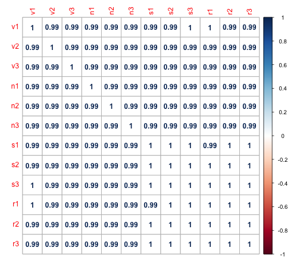
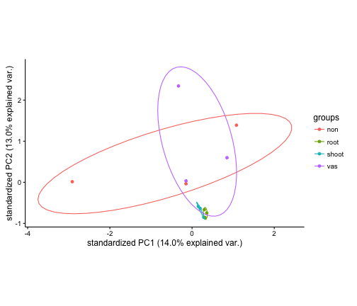
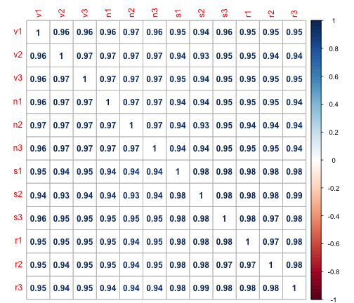
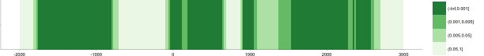
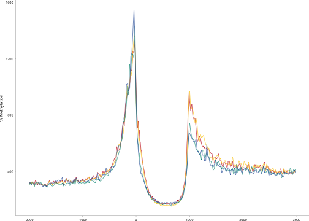
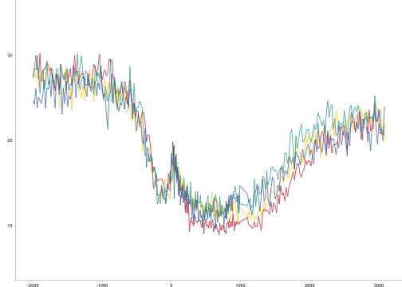
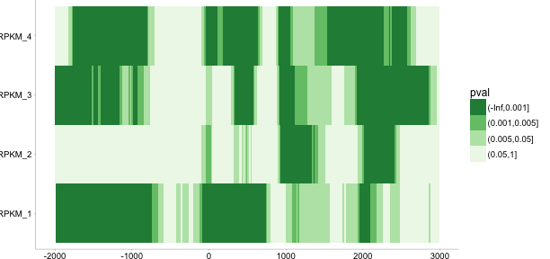

Supplemental heatmaps tissues and RPKMs
========================================================

## General 


```r
library(reshape)
library(ggplot2)
library(PMCMR)
genebody_pval = function(x)
{
  genebody = x[which(x$pos >= 0 & x$pos <= 1000),]
  d = kruskal.test(freq ~ mtype, data = genebody) 

  c <- posthoc.kruskal.nemenyi.test(freq ~ mtype, data=genebody, dist="Tukey")
  y <- data.frame(c$p.value)
  ttype  <- c("shoot","vascular","nonvascular","shoot","vascular","nonvascular","shoot","vascular","nonvascular")

  z <- cbind.data.frame(melt(y),ttype)
  z$pval <- cut(z$value, breaks = c(0, 0.0001, 0.001, 0.01, 1))
  z$ttype <- factor(z$ttype, levels = c("nonvascular","","vascular","shoot"))
  ggplot(z, aes(variable, ttype, fill = pval)) + geom_tile(colour = "black") + scale_fill_brewer(palette = "Blues",direction=-1, limits=c("(0,0.0001]","(0.0001,0.01]","(0.001,0.01]")) + theme_classic() + theme(text=element_text(size=20))    +  
    theme(text=element_text(size=12), panel.margin = unit(0, "cm"), 
          plot.margin = unit(c(0, 0, 0.01, 0), "cm"),axis.ticks = element_line(size = 0.1), 
          axis.line = element_line(size = 0.1), axis.ticks.length = unit(0.05, "cm"), axis.ticks.margin =unit(0, "cm")) + 
    xlab(NULL) + ylab(NULL) 
}
```


```r
upstream_pval = function(x)
{
  up = x[which(x$pos < 0),]
  d = kruskal.test(freq ~ mtype, data = up) 

  c <- posthoc.kruskal.nemenyi.test(freq ~ mtype, data=up, dist="Tukey")
  y <- data.frame(c$p.value)
  ttype  <- c("shoot","vascular","nonvascular","shoot","vascular","nonvascular","shoot","vascular","nonvascular")

  z <- cbind.data.frame(melt(y),ttype)
  z$pval <- cut(z$value, breaks = c(0, 0.0001, 0.001, 0.01, 1))
  z$ttype <- factor(z$ttype, levels = c("nonvascular","","vascular","shoot"))
  ggplot(z, aes(variable, ttype, fill = pval)) + geom_tile(colour = "black") + scale_fill_brewer(palette = "Blues",direction=-1, limits=c("(0,0.0001]","(0.0001,0.01]","(0.001,0.01]")) + theme_classic() + theme(text=element_text(size=20))    +  
    theme(text=element_text(size=12), panel.margin = unit(0, "cm"), 
          plot.margin = unit(c(0, 0, 0.01, 0), "cm"),axis.ticks = element_line(size = 0.1), 
          axis.line = element_line(size = 0.1), axis.ticks.length = unit(0.05, "cm"), axis.ticks.margin =unit(0, "cm")) + 
    xlab(NULL) + ylab(NULL) 
}
```


```r
downstream_pval = function(x)
{
 
  down = x[which(x$pos > 1000),]
  d = kruskal.test(freq ~ mtype, data = down) 

  c <- posthoc.kruskal.nemenyi.test(freq ~ mtype, data=down, dist="Tukey")
  y <- data.frame(c$p.value)
  ttype  <- c("shoot","vascular","nonvascular","shoot","vascular","nonvascular","shoot","vascular","nonvascular")

  z <- cbind.data.frame(melt(y),ttype)
  z$pval <- cut(z$value, breaks = c(0, 0.0001, 0.001, 0.01, 1))
  z$ttype <- factor(z$ttype, levels = c("nonvascular","","vascular","shoot"))
  ggplot(z, aes(variable, ttype, fill = z$pval)) + geom_tile(colour = "black") + scale_fill_brewer(palette = "Blues",direction=-1, limits=c("(0,0.0001]","(0.0001,0.01]","(0.001,0.01]")) + theme_classic() + theme(text=element_text(size=20))    +  
    theme(text=element_text(size=12), panel.margin = unit(0, "cm"), 
          plot.margin = unit(c(0, 0, 0.01, 0), "cm"),axis.ticks = element_line(size = 0.1), 
          axis.line = element_line(size = 0.1), axis.ticks.length = unit(0.05, "cm"), axis.ticks.margin =unit(0, "cm")) + 
    xlab(NULL) + ylab(NULL) 
}
```


```r
regional_pval = function(x)
{
  down = x[which(x$pos > 1000),]
  up =  x[which(x$pos < 0),]
  genebody = x[which(x$pos >= 0 & x$pos <= 1000),]

  d = kruskal.test(freq ~ mtype, data = up) 
  u = kruskal.test(freq ~ mtype, data = down) 
  g = kruskal.test(freq ~ mtype, data = genebody) 
  l <- cbind(d$p.value,g$p.value,u$p.value)
  colnames(l) <- c("upstream","genebody","downstream")
  rownames(l) <- c("t")
  y <- data.frame(l) 
  a <- c("all")
  z <- cbind.data.frame(melt(y),a)
  z$pval <- cut(z$value, breaks = c(0, 0.0001, 0.001, 0.01, 1))
  ggplot(z, aes(variable, a, fill = z$pval)) + geom_tile(colour = "black") + scale_fill_brewer(palette = "Blues",direction=-1, limits=c("(0,0.0001]","(0.0001,0.01]","(0.001,0.01]")) + theme_classic() + theme(text=element_text(size=20))    +  
    theme(text=element_text(size=12), panel.margin = unit(0, "cm"), 
          plot.margin = unit(c(0, 0, 0.01, 0), "cm"),axis.ticks = element_line(size = 0.1), 
          axis.line = element_line(size = 0.1), axis.ticks.length = unit(0.05, "cm"), axis.ticks.margin =unit(0, "cm")) + 
    xlab(NULL) + ylab(NULL) 
}
```


# RPKM 

```r
file_name = "/Users/gturco/Documents/Data/Sorg/TSS/rpkm_new/all.shoot.CG.filtered.txt"
x = read.table(file_name, col.names=c("pos","freq","mtype"))
#x$mtype <- factor(x$mtype, levels = c("root","shoot","vascular","nonvascular"))
x$mtype <- factor(x$mtype, levels = c("1","2","3","4"))
x$mtype <- factor(x$mtype, levels = c(1,2,3,4))
regional_pval(x)
```

```
## Using  as id variables
```

```
## Warning: `axis.ticks.margin` is deprecated. Please set `margin` property of
## `axis.text` instead
```


```r
file_name = "/Users/gturco/Documents/Data/Sorg/TSS/rpkm_new/all.root.CG.filtered.txt"
x = read.table(file_name, col.names=c("pos","freq","mtype"))
#x$mtype <- factor(x$mtype, levels = c("root","shoot","vascular","nonvascular"))
x$mtype <- factor(x$mtype, levels = c("1","2","3","4"))
x$mtype <- factor(x$mtype, levels = c(1,2,3,4))
regional_pval(x)
```

```
## Using  as id variables
```

```
## Warning: `axis.ticks.margin` is deprecated. Please set `margin` property of
## `axis.text` instead
```


```r
file_name = "/Users/gturco/Documents/Data/Sorg/TSS/rpkm_new/all.vascular.CpG.filtered.txt"
x = read.table(file_name, col.names=c("pos","freq","mtype"))
#x$mtype <- factor(x$mtype, levels = c("root","shoot","vascular","nonvascular"))
x$mtype <- factor(x$mtype, levels = c("1","2","3","4"))
x$mtype <- factor(x$mtype, levels = c(1,2,3,4))
regional_pval(x)
```

```
## Using  as id variables
```

```
## Warning: `axis.ticks.margin` is deprecated. Please set `margin` property of
## `axis.text` instead
```


```r
file_name = "/Users/gturco/Documents/Data/Sorg/TSS/rpkm_new/all.nonvascular.CG.filtered.txt"
x = read.table(file_name, col.names=c("pos","freq","mtype"))
#x$mtype <- factor(x$mtype, levels = c("root","shoot","vascular","nonvascular"))
x$mtype <- factor(x$mtype, levels = c("1","2","3","4"))
x$mtype <- factor(x$mtype, levels = c(1,2,3,4))
regional_pval(x)
```

```
## Using  as id variables
```

```
## Warning: `axis.ticks.margin` is deprecated. Please set `margin` property of
## `axis.text` instead
```


### CG methylation differs significantly (p<0.0001) within the the genebody of genes of varying levels of expression. In shoot and vascular tissue there are also significant (p <0.0001) methlyation changes seen  upstream  and downstream the gene assocated with changes in gene expression. 

# CHG


```r
file_name = "/Users/gturco/Documents/Data/Sorg/TSS/rpkm_new/all.shoot.filtered.CHG.txt"
x = read.table(file_name, col.names=c("pos","freq","mtype"))
#x$mtype <- factor(x$mtype, levels = c("root","shoot","vascular","nonvascular"))
x$mtype <- factor(x$mtype, levels = c("1","2","3","4"))
x$mtype <- factor(x$mtype, levels = c(1,2,3,4))
regional_pval(x)
```

```
## Using  as id variables
```

```
## Warning: `axis.ticks.margin` is deprecated. Please set `margin` property of
## `axis.text` instead
```




```r
file_name = "/Users/gturco/Documents/Data/Sorg/TSS/rpkm_new/all.root.filtered.CHG.txt"
x = read.table(file_name, col.names=c("pos","freq","mtype"))
#x$mtype <- factor(x$mtype, levels = c("root","shoot","vascular","nonvascular"))
x$mtype <- factor(x$mtype, levels = c("1","2","3","4"))
x$mtype <- factor(x$mtype, levels = c(1,2,3,4))
regional_pval(x)
```

```
## Using  as id variables
```

```
## Warning: `axis.ticks.margin` is deprecated. Please set `margin` property of
## `axis.text` instead
```


```r
file_name = "/Users/gturco/Documents/Data/Sorg/TSS/rpkm_new/all.vascular.CHG.filtered.txt"
x = read.table(file_name, col.names=c("pos","freq","mtype"))
#x$mtype <- factor(x$mtype, levels = c("root","shoot","vascular","nonvascular"))
x$mtype <- factor(x$mtype, levels = c("1","2","3","4"))
x$mtype <- factor(x$mtype, levels = c(1,2,3,4))
regional_pval(x)
```

```
## Using  as id variables
```

```
## Warning: `axis.ticks.margin` is deprecated. Please set `margin` property of
## `axis.text` instead
```


```r
file_name = "/Users/gturco/Documents/Data/Sorg/TSS/rpkm_new/all.nonvascular.filtered.CHG.txt"
x = read.table(file_name, col.names=c("pos","freq","mtype"))
#x$mtype <- factor(x$mtype, levels = c("root","shoot","vascular","nonvascular"))
x$mtype <- factor(x$mtype, levels = c("1","2","3","4"))
x$mtype <- factor(x$mtype, levels = c(1,2,3,4))
regional_pval(x)
```

```
## Using  as id variables
```

```
## Warning: `axis.ticks.margin` is deprecated. Please set `margin` property of
## `axis.text` instead
```



### CHG methylation differs significantly (p<0.0001) upstream and downstream genes of varying levels of expressionin all tissues. 


# CHH


```r
file_name = "/Users/gturco/Documents/Data/Sorg/TSS/rpkm_new/all.shoot.CHH.filtered.txt"
x = read.table(file_name, col.names=c("pos","freq","mtype"))
#x$mtype <- factor(x$mtype, levels = c("root","shoot","vascular","nonvascular"))
x$mtype <- factor(x$mtype, levels = c("1","2","3","4"))
x$mtype <- factor(x$mtype, levels = c(1,2,3,4))
regional_pval(x)
```

```
## Using  as id variables
```

```
## Warning: `axis.ticks.margin` is deprecated. Please set `margin` property of
## `axis.text` instead
```




```r
file_name = "/Users/gturco/Documents/Data/Sorg/TSS/rpkm_new/all.root.CHH.filtered.txt"
x = read.table(file_name, col.names=c("pos","freq","mtype"))
#x$mtype <- factor(x$mtype, levels = c("root","shoot","vascular","nonvascular"))
x$mtype <- factor(x$mtype, levels = c("1","2","3","4"))
x$mtype <- factor(x$mtype, levels = c(1,2,3,4))
regional_pval(x)
```

```
## Using  as id variables
```

```
## Warning: `axis.ticks.margin` is deprecated. Please set `margin` property of
## `axis.text` instead
```


```r
file_name = "/Users/gturco/Documents/Data/Sorg/TSS/rpkm_new/all.vascular.CHH.filtered.txt"
x = read.table(file_name, col.names=c("pos","freq","mtype"))
#x$mtype <- factor(x$mtype, levels = c("root","shoot","vascular","nonvascular"))
x$mtype <- factor(x$mtype, levels = c("1","2","3","4"))
x$mtype <- factor(x$mtype, levels = c(1,2,3,4))
regional_pval(x)
```

```
## Using  as id variables
```

```
## Warning: `axis.ticks.margin` is deprecated. Please set `margin` property of
## `axis.text` instead
```




```r
file_name = "/Users/gturco/Documents/Data/Sorg/TSS/rpkm_new/all.nonvascular.filtered.CHH.txt"
x = read.table(file_name, col.names=c("pos","freq","mtype"))
#x$mtype <- factor(x$mtype, levels = c("root","shoot","vascular","nonvascular"))
x$mtype <- factor(x$mtype, levels = c("1","2","3","4"))
x$mtype <- factor(x$mtype, levels = c(1,2,3,4))
regional_pval(x)
```

```
## Using  as id variables
```

```
## Warning: `axis.ticks.margin` is deprecated. Please set `margin` property of
## `axis.text` instead
```


### CHH methylation differs significantly (p<0.0001) downstream and within the genes of varying levels of expressionin for root and shoot organs only. 

# TISSUEs

## CG RPKM 1


```r
file_name = "/Users/gturco/Documents/Data/Sorg/TSS/rpkm_new/tissue/Tissue/CG_all_1.txt"
x = read.table(file_name, col.names=c("pos","freq","mtype"))
x$mtype <- factor(x$mtype, levels = c("root","shoot","vascular","nonvascular"))
regional_pval(x)
```

```
## Using  as id variables
```

```
## Warning: `axis.ticks.margin` is deprecated. Please set `margin` property of
## `axis.text` instead
```



```r
upstream_pval(x)
```

```
## Using  as id variables
```

```
## Warning: `axis.ticks.margin` is deprecated. Please set `margin` property of
## `axis.text` instead
```


```r
genebody_pval(x)
```

```
## Using  as id variables
```

```
## Warning: `axis.ticks.margin` is deprecated. Please set `margin` property of
## `axis.text` instead
```


### CG m
## CHG RPKM 4


```r
file_name = "/Users/gturco/Documents/Data/Sorg/TSS/rpkm_new/tissue/Tissue/CHG_all_4.txt"
x = read.table(file_name, col.names=c("pos","freq","mtype"))
x$mtype <- factor(x$mtype, levels = c("root","shoot","vascular","nonvascular"))
regional_pval(x)
```

```
## Using  as id variables
```

```
## Warning: `axis.ticks.margin` is deprecated. Please set `margin` property of
## `axis.text` instead
```



```r
upstream_pval(x)
```

```
## Using  as id variables
```

```
## Warning: `axis.ticks.margin` is deprecated. Please set `margin` property of
## `axis.text` instead
```


```r
genebody_pval(x)
```

```
## Using  as id variables
```

```
## Warning: `axis.ticks.margin` is deprecated. Please set `margin` property of
## `axis.text` instead
```


## CHH RPKM 4


```r
file_name = "/Users/gturco/Documents/Data/Sorg/TSS/rpkm_new/tissue/Tissue/CHH_all_4.txt"
x = read.table(file_name, col.names=c("pos","freq","mtype"))
x$mtype <- factor(x$mtype, levels = c("root","shoot","vascular","nonvascular"))
regional_pval(x)
```

```
## Using  as id variables
```

```
## Warning: `axis.ticks.margin` is deprecated. Please set `margin` property of
## `axis.text` instead
```



```r
upstream_pval(x)
```

```
## Using  as id variables
```

```
## Warning: `axis.ticks.margin` is deprecated. Please set `margin` property of
## `axis.text` instead
```


```r
genebody_pval(x)
```

```
## Using  as id variables
```

```
## Warning: `axis.ticks.margin` is deprecated. Please set `margin` property of
## `axis.text` instead
```


```r
downstream_pval(x)
```

```
## Using  as id variables
```

```
## Warning: `axis.ticks.margin` is deprecated. Please set `margin` property of
## `axis.text` instead
```


